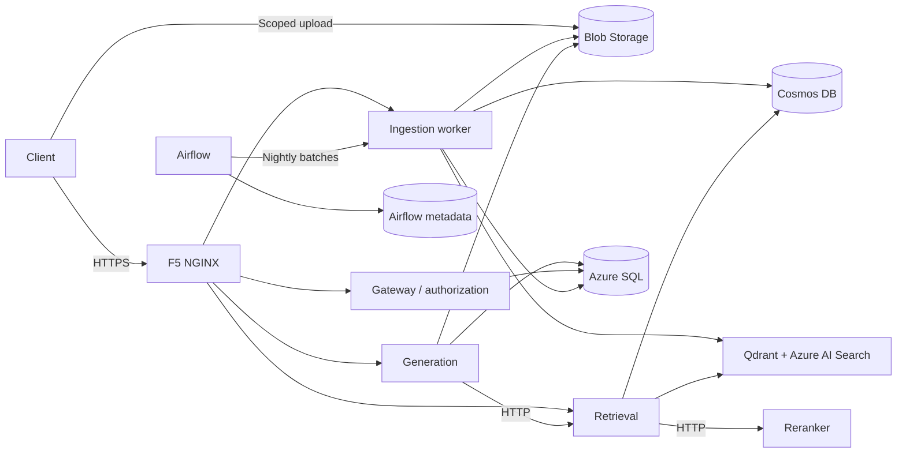

# medwriter-assist

An Azure application scaffold for retrieval-augmented medical writing. It connects
document upload, durable ingestion, hybrid search, streamed drafting and acceptance,
with source citations and release provenance retained throughout the workflow.

**Status:** the application uses deterministic placeholder models. Outputs are
not medically validated. The deployment configuration is being standardized on
Terraform and Flux; that replacement deployment path is still awaiting live Azure
commissioning. Azure is the only supported application deployment target.

## Capabilities

- Upload files directly to Azure Blob Storage, preserving their original bytes
  and verifying their size and SHA-256 checksum. The current limit is 5 MiB.
- Process documents immediately or defer them to an Airflow batch scheduled for
  **02:00 Australia/Brisbane**. Both paths use the same durable ingestion worker.
- Resume interrupted jobs from persisted checkpoints, retain document revisions
  and publish a coherent study generation across Qdrant and Azure AI Search.
- Retrieve from both indexes, rerank over HTTP and stream a draft with citations.
  Completion confirms the draft and its provenance have been persisted in SQL.
- Accept a specific draft under an authenticated identity. Entra authentication
  and study membership control access; runtime audit records are append-only.

## Architecture

| Component | Responsibility |
|---|---|
| Gateway | JWT and study authorization, upload registration, document access and draft acceptance |
| Ingestion worker | Durable jobs, document processing, checkpoints and index publication |
| Retrieval | Select a study generation, query both indexes, fuse results and request reranking |
| Reranker | Score retrieved passages through its HTTP interface |
| Generation | Retrieve evidence, stream output and persist the draft and audit |
| Airflow | Admit scheduled batches and track their outcomes |

Blob Storage retains immutable sources and processing evidence. Cosmos DB holds
jobs, leases, checkpoints and the active study generation. Azure SQL holds study
membership, drafts and audit. PostgreSQL stores Airflow's scheduling metadata.
Serving indexes can be rebuilt without changing historical source identities.

## Deployment and delivery

Each layer has a defined owner:

| Layer | Tooling |
|---|---|
| Azure resources and access | Terraform, with separate persistent bootstrap and application environment roots |
| CI, image builds and schema migration | Azure Pipelines, Docker Buildx/Bake and Flyway Community |
| Kubernetes desired state | Flux and Helm, including upstream Airflow and Qdrant charts |
| HTTPS and encrypted configuration | cert-manager; SOPS with Azure Key Vault and workload identity |
| Monitoring and scaling | Prometheus, Application Insights and KEDA |

GitHub hosts the source; Azure Pipelines owns CI and release automation. The
[validation pipeline](deploy/azure-pipelines/validation.yml) checks pull requests,
builds and smoke-tests all six images, and tests SQL migrations against a disposable
database without Azure deployment access. After merging, the
[delivery pipeline](deploy/azure-pipelines/delivery.yml) checks and publishes the
release, while the [infrastructure pipeline](deploy/azure-pipelines/infrastructure.yml)
plans resource changes and applies them only when explicitly requested. Flux
reconciles Kubernetes installations through Helm; Terraform owns Azure resources.

The development configuration uses AKS Free tier with one node, small persistent
disks, ACR Basic and a small Azure SQL database. Compatible existing free-tier
Search and Cosmos accounts can be supplied by resource ID; the application owns
its separate index and database. Free-tier stores do not make the whole deployment
free. Staging and production overlays are configuration templates requiring
commissioning and capacity planning.

Configuration starts with the examples in
[`infra/terraform/bootstrap`](infra/terraform/bootstrap/terraform.tfvars.example.json)
and [`infra/terraform/environment`](infra/terraform/environment/terraform.tfvars.example.json).
Bootstrap establishes remote state, encryption keys and delivery identities.
The environment provisions Azure resources; its outputs configure Flux. An initial
pipeline release and Flux bootstrap complete the application installation.
Subsequent infrastructure changes use reviewed Terraform plans; application
changes use the delivery pipeline.

The [Makefile](Makefile) exposes these entry points:

| Command | Purpose |
|---|---|
| `make bootstrap-plan` / `make bootstrap-apply` | Establish the persistent platform prerequisites |
| `make azure-plan` / `make azure-up` | Check capacity and costs, then apply a reviewed infrastructure plan |
| `make azure-release` | Queue the application delivery pipeline |
| `make api-run FILE=… STUDY=… SECTION=…` | Exercise an installed application's upload-to-acceptance workflow |
| `make azure-down` | Destroy owned runtime resources and application data, preserving bootstrap resources and supplied accounts |

These commands require configured accounts and deployment variables; `azure-up`
alone does not bootstrap or deliver the application. The normal client verifies
public HTTPS certificates and uses real Entra authentication. There is no frontend
or alternate demonstration mode.

## Releases and versioning

A release selects six immutable image digests, source and chart revisions, model
identities, embedding compatibility and a content-derived prompt hash. The pipeline
checks the packaged images and migrates their SQL before committing a release
selection. Flux reconciles that Git selection into Helm releases. Compatible
rollbacks select existing artifacts without rebuilding images or manually upgrading
Flux-owned releases. Earlier audit records retain the release that produced them.

## Repository guide

| Path | Contents |
|---|---|
| [`services/`](services/) | Five application services, Airflow packaging and generation prompts |
| [`libs/medw_core/`](libs/medw_core/) | Shared contracts, settings, authorization, persistence and workflow operations |
| [`pipelines/`](pipelines/) | Active ingestion DAG, layout prototype and future parsing/reindexing work |
| [`db/`](db/) | SQL migrations, Flyway configuration and data schema definitions |
| [`infra/terraform/`](infra/terraform/) | Bootstrap and environment resources, variables and outputs |
| [`deploy/`](deploy/) | Azure Pipelines, Helm charts, Flux configuration and immutable release records |
| [`scripts/`](scripts/) | API client, administration, preflight and release-specific helpers |
| [`tests/`](tests/) | Offline checks, packaged-image checks and opt-in Azure integration checks |
| [`ml/`](ml/) / [`evals/`](evals/) | Model and evaluation scaffolding for future implementation |

## Current limits and extension points

Extraction currently uses bounded text decoding or a filename/checksum fallback;
embeddings use token hashing; reranking uses lexical overlap; generation emits
scripted text. Medical verification explicitly reports `not_performed`. Replacing
these implementations should preserve the surrounding API, storage and provenance
contracts. Remote model adapters are retained but are not required or provisioned
by the installed workflow.

Medical parsing, clinical evaluation, backfill/reindexing, a frontend and
multi-node availability remain planned work. Offline tests use explicit test
doubles; they do not constitute a second deployment architecture.
