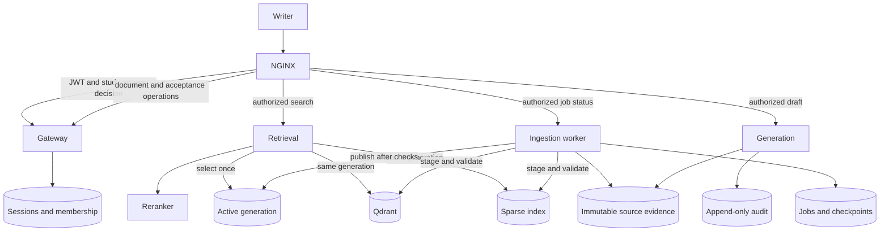

# medwriter-assist

A platform scaffold for a medical writing assistant that will draft Clinical
Study Report sections from source evidence. The retained code covers service
boundaries, authentication, durable state, evidence identity, release/version
control, recovery and telemetry. Medical parsing, ranking, drafting and
verification implementations remain deliberately held back.

This README is the project's documentation: current state, architecture,
decisions, corrected errors and operating procedures. The two Markdown files
under `services/generation/app/prompts/` are application templates, not project
documentation. Recorded verification results are preserved in
[docs/verification.json](docs/verification.json).

Contents: [Local development](#local-development) · [Architecture](#architecture) ·
[Major decisions](#major-decisions) · [Corrected errors](#corrected-errors) ·
[Deliberate gaps](#deliberate-gaps-and-next-work) ·
[Releases](#releases-and-versioning) · [Verification](#verification) ·
[Operations](#operational-signals-and-recovery) · [Azure](#azure-commissioning) ·
[Walkthrough](#file-walkthrough)

## Current state

The platform scaffolding is implemented and ready for a file-by-file review.
The September 2026 completion verification passed 197 tests, six import
contracts, Ruff, mypy, six deployable chart checks and five Flux configurations.
All five service images built and passed startup/dependency checks. Disposable
local exercises demonstrated persistent state, actual SQL audit permissions,
Qdrant node loss and fresh restore, Flux rollout/rollback, enforced caller
restrictions and KEDA scaling from one replica to four and back to one.

These results use synthetic data. Live Azure commissioning and medical-quality
validation remain separate. The evidence records the completion run before
this documentation consolidation: its image digests, temporary Git revisions
and prompt hashes identify those tested artifacts. They are not regenerated
claims about later builds. No live Azure deployment or shared Git push was
performed by the completion or documentation passes.

The current supervisor-review changes passed `make check` on 15 September 2026
using host Python 3.12.13: 240 tests, six import contracts, Ruff/mypy, six
application/data charts, five Flux configurations and the pinned F5 NGINX
controller render. These changes simplify settings, clarify telemetry startup
and move job/search/draft forwarding into the maintained NGINX controller.
All five updated images built and passed startup checks as `nginx-switch-20260915`.

The updated Compose exercise passed startup, persistent-state restart, isolated
retrieval failure and recovery checks. A disposable Kubernetes 1.35.1 cluster
with the actual F5 controller and Calico passed direct routing, JWT/study access,
spoofed-header rejection, streaming, certificate/SNI/redirect, network-policy
and backend/auth outage checks. These use generated keys and synthetic data;
real DNS, cloud load-balancer behavior and Azure access remain operator checks.
Earlier recovery/Flux/KEDA evidence was not rerun or relabelled.

## Local development

Requires Python 3.11 or newer, Docker, Helm and kubectl. The clean-install proof
used host Python 3.14.7; service images use locked Python 3.11 dependencies.
The editable host environment resolves development dependencies separately.

```sh
make dev
source .venv/bin/activate
make check
make up-full
# After stopping the foreground Compose process:
make down
```

`make up` starts Qdrant, retrieval and the synthetic reranker; `make up-full`
adds gateway, generation and ingestion. No Azure credentials are mounted.
SQLite state and immutable artifacts persist in the `platform_state` named
volume, mounted at `/data`; Qdrant has its own volume. `make down` preserves
both. `.env.example` configures services run directly on the host; Compose
supplies its own explicit local settings. `make up-legacy` additionally starts
Chroma for the retained legacy-store setup.

| Service | Host port | Platform behavior |
|---|---|---|
| Gateway | 8000 | JWT/study access decisions, document metadata and acceptance shell |
| Retrieval | 8001 | Shared dense/sparse generation selection; fusion held back |
| Reranker | 8002 | Explicit deterministic local double |
| Generation | 8003 | Lifecycle, provenance and audit dependencies; drafting held back |
| Ingestion worker | 8004 | Durable job-status shell; clinical ingestion held back |

Every service exposes `/healthz`, `/readyz`, `/version` and `/metrics`.
Liveness reports whether the process is alive; bounded, cached readiness
checks report dependency availability. The assembled local stack becomes ready;
gateway readiness depends on its own stores and identity provider; retrieval
readiness also depends on its reranker. A backend outage does not withdraw the
gateway. Synthetic mode skips identity-provider readiness, but never JWT checks.
The real reranker is live but unready until its implementation and weights exist.

`/_synthetic/work?seconds=5` streams bounded test work only when explicitly
enabled with the local backend in a local/test environment. It makes no model
call. The Kubernetes public routes require verified JWTs and explicit study membership;
unknown users/studies fail closed. Unimplemented medical handlers return 501
rather than successful empty responses. `make seed` and `make eval` remain
held-back entrypoints, not working medical ingestion/evaluation commands.

Compose exposes application ports on localhost for diagnostics; it does not run
the Kubernetes NGINX controller. Direct backend ports bypass the edge access
check. Use the disposable ingress proof below to test the public API boundary.
Do not publish those diagnostic ports externally.

## Architecture

Five FastAPI services share [medw_core](libs/medw_core/).
[ports.py](libs/medw_core/ports.py) defines dependency interfaces;
[schemas.py](libs/medw_core/schemas.py) defines shared data;
[composition.py](libs/medw_core/composition.py) selects service-specific adapters;
[service.py](libs/medw_core/service.py) owns lifecycle, probes and request middleware;
[telemetry.py](libs/medw_core/telemetry.py) configures process logging/exporters.
Import contracts prevent domain interfaces from depending on vendor SDK types.



The arrows describe platform contracts and intended request flow. Held-back
medical handlers do not yet execute that full workflow.

| Service | Owned dependencies |
|---|---|
| Gateway | Sessions/document metadata, SQL study membership, fixed JWT key provider |
| Retrieval | Embedder, read-only Qdrant/Search, generation registry, HTTP reranker |
| Generation | Chat client, SQL audit, retained evidence and reference markers |
| Ingestion | Embedder, documents, durable jobs, evidence, registry and audit; publication accepts explicit sinks |
| Reranker | Local double or held-back real model; no Azure role assignments |

| Data | Azure/deployed store | Local implementation |
|---|---|---|
| Source bytes | Content-addressed Blob objects | Content-addressed files |
| Documents and sessions | Cosmos; sessions partitioned by user | SQLite |
| Jobs, evidence manifests, retention references, index pointers | Cosmos `platform-state`, partitioned by study, no TTL | SQLite conditional revisions |
| Dense serving data | Qdrant collection per study/generation | Real Qdrant |
| Sparse serving data | Shared Search index with study/generation filters | Durable SQLite generations and synthetic BM25 |
| Registry, membership, audit | SQL | SQLite adapters; separate real SQL verification |

Local chat, embedding and reranking report synthetic identities. Their success
proves platform behavior, not medical performance.

## Major decisions

**One settings class for the scaffold.** `Settings` contains the shared set of
configuration fields; every service can access them. Existing `MEDW_` variables,
Helm values and `.env` files keep working. Missing Azure endpoints use `None`,
and legacy blank strings normalize to `None`. Client factories check the values
they need when they are called; local adapters do not require Azure configuration.
Missing settings produce named errors and leave the service live but unready.
The duplicate capability models were removed: they added validation objects
without giving services distinct settings attributes. A future hierarchy should
start with a minimal base and add fields only to the subclasses that need them.

**The current service boundaries remain under review.** The original brief's
five-service arrangement is retained. Streaming requires a suitable request
path; it does not by itself require generation to be a separate deployment.
Separate identity, scaling and release ownership are reasons to keep that
boundary if the product needs them. Generation as application code inside the
writer API, and bulk generation driven by Airflow, remain design options for a
later decision. The FastAPI gateway currently owns JWT and database-backed study
authorization. NGINX calls its small internal access-decision endpoint before
forwarding job/search/draft requests directly to the relevant backend. Those
request/response bodies no longer pass through Python gateway forwarding code.
Gateway readiness is independent of those backends. Document operations and
acceptance remain gateway responsibilities; generation's deployment boundary
is unchanged.

**Evidence-led RAG and a deterministic numeric path.** The target design uses
retrieval and versioned prompts rather than generative fine-tuning. Numerical
content should come from parsed source structures, with the model supplying
connective prose and separate numerical/structural checks. Those medical
algorithms and full clinical prompts remain unimplemented here.
`section_draft.md` is a placeholder; `structural_verdict.md` sketches a
schema-driven judgement prompt. Neither establishes clinical correctness.

**Immutable evidence survives reindexing.** A logical document can change;
its source revisions cannot. Revision identity includes study, document and
content hash. Chunks carry source revision, parser version and source location.
[sources.py](libs/medw_core/sources.py) resolves citations from archived evidence
independently of serving indexes. Published generations and audited citations
retain reference markers. No automatic evidence deletion or regulatory
retention period is invented. Session/draft TTLs do not govern cited evidence.

**One published generation coordinates two stores.** Qdrant provides explicit
collection/vector control; Search supplies the lexical half. A generation names
both stores, embedding model/deployment/version/dimensions, parser identity and
expected chunk count/payload hash. [indexing.py](libs/medw_core/indexing.py) stages
both stores, inspects their data, requires a passing evaluation callback,
retains evidence and conditionally updates one active pointer. Retrieval selects
that pointer once for both searches and rejects incompatible embedding identities.
Partial writes or failed evaluation leave the old selection active. Rollback
revalidates the retained target and reader compatibility. This costs temporary
duplicate storage and orphan cleanup; it avoids claiming a cross-store transaction.

**Cosmos state and SQL audit have different contracts.** State needs conditional
point updates; audit needs relational queries and independent INSERT-only
permissions. SQL stores output, its hash, citations, the selected index manifest
and release/model/config provenance across 27 audit fields. Evidence retention
precedes the INSERT: a failed SQL write can leave a conservative reference, but
cannot remove cited evidence. No cross-store foreign key is implied.

**Jobs persist before work starts.** [durable_jobs.py](libs/medw_core/durable_jobs.py)
uses conditional revisions/ETags, expiring worker leases and immutable checkpoint
references. A replacement worker skips committed stages and recovers expired
claims; stale workers cannot commit after ownership changes. A crash may repeat
an uncommitted stage, so callbacks must be idempotent. Background tasks alone
are not the durability mechanism; clinical callbacks are still held back.

**Permissions follow service responsibilities.** Each service has its own
managed identity and federated service account; backup has a separate identity.
Retrieval reads indexes and registry state. Generation can append evidence
references and audit rows, without replacing/deleting evidence. JWT signature,
fixed issuer/audience/tenant and temporal claims are validated before study access.
Internal calls rely on enforced NetworkPolicy. Azure control-plane roles are
not assumed to grant data-plane operations: test each required action under
its actual identity, including after RBAC propagation and token renewal.

**Artifact identity and deployment configuration are separate.** Images are
selected by digest, charts by Git revision, and behavior by a release bundle.
Each environment owns its selection. See [release rules](#releases-and-versioning).
Model names and dated deployment labels are insufficient: readiness checks
actual deployment metadata and disabled automatic upgrades without inference.

**Residency, networking and recovery are deployment decisions.** Bootstrap's
chat deployment uses `GlobalStandard` for the synthetic learning setup; it does
not establish suitability for client data. Verify deployment type, region,
contractual boundary and quota before commissioning. AKS explicitly selects
Azure CNI Overlay/Cilium. SQL uses Proxy to match TCP 1433 egress. Qdrant
replication protects availability; independent snapshots provide recovery.
Historical quota observations are not current subscription facts.

## Corrected errors

| Earlier issue | Correction and evidence |
|---|---|
| Dense/sparse filters and payloads could diverge | Shared filters/projections, generation selection and payload readback tests |
| Chunk IDs alone were treated as proof of index equality | Verify counts and payload content before publication and rollback |
| Source edits and reindexing could lose citation history | Immutable source revisions and evidence retained outside serving indexes |
| In-memory jobs/audit and Python interface shape implied durability | Persistent checkpoints/leases; actual SQL readback and denied UPDATE/DELETE |
| Every service constructed unrelated dependencies; wiring implied readiness | Service-specific composition, bounded reachability/recovery checks and explicit held-back responses |
| Shared image/chart settings could move another environment | Per-environment bundle selection, exact image digests and pinned chart source |
| Image tags, chart versions or missing packaged modules hid stale/broken builds | Revision reconciliation, locked dependencies and all-five-image startup checks |
| A dated deployment label and a configured prompt hash implied actual identity | Model metadata verification and hashes computed from packaged prompt bytes |
| Failed renders/migrations or concurrent release writes could be mishandled | Failure-propagating checks, tracked transactional migrations and retry-safe Git commits |
| Metrics providers could replace one another; quick handlers never proved scale-up | One provider/two readers, cancellation-safe streaming counters and measured KEDA 1→4→1 |
| Three Qdrant pods and PVCs implied clustering/backups | Peer bootstrap, explicit replication, snapshots and fresh restore with verified shard placement |
| Network policies existed without proven enforcement; SQL egress mismatched routing | Local Calico allow/deny proof, explicit AKS Cilium and SQL Proxy configuration |
| Empty Azure strings reached SDK construction; configuration roles were unclear | Optional environment inputs and explicit checks where client settings are used |
| Request instrumentation and exporter startup looked duplicated | Named middleware attachment, one telemetry startup function and shared provenance serialization |
| Python forwarding coupled gateway availability to every backend | Direct NGINX routes plus a body-free access check; backend outage leaves writer/auth operations available |
| Local overlay/NGINX field mismatches escaped default renders | Every local values file now renders in `make check`; actual controller acceptance, local adapters and request behavior verified |
| Charts assumed the retired community ingress-nginx controller | Maintained F5 NGINX OSS controller; direct routes, centralized access subrequests, TLS and controller pod/namespace selectors |

Earlier boundary work also corrected missing projection fields and retry handling
that crashed when throttling errors lacked a response. The executable tests and
recorded evidence support these corrections; historical Azure demonstrations
are not substituted for current cloud verification.

## Deliberate gaps and next work

- **Medical implementation:** parsers/chunking, pipeline CLI, worker callbacks,
  bulk DAG execution, fusion, real reranker/classifier weights, numeric rendering,
  drafting and verification remain held back. The backfill sketch fails explicitly;
  its evaluation edge is connected, but it is not a working clinical pipeline.
- **Medical evaluation:** no populated approved golden set or measured recall,
  numerical fidelity, clinical accuracy or regulatory-compliance result. The
  publication evaluator contract works with synthetic callbacks only.
- **Cloud commissioning:** real Entra/managed identity, Cosmos/Search/Blob round
  trips, SQL token renewal, destination ACR, hosted pipelines, AKS networking and
  Azure telemetry/backup destination require live checks.
- **Product scope:** no frontend, client rule catalogue, completed clinical prompt
  content, automatic evidence deletion policy or subscription-level IaC product.
  `infra/bootstrap.sh` is an imperative provisioning recipe requiring review.

The preserved implementation branch is `implementation/retrieval-slice`
(`089dd50`); ignored `holding/` is only a convenience copy. Restore components
one at a time and adapt them to the current source, job and generation contracts.
Start with fixtures/parsers and pipeline callbacks, then fusion/weights and a
measured evaluator, then drafting/verification. Copying the old branch wholesale
would bypass the completed platform changes.

## Releases and versioning

[scripts/release.py](scripts/release.py) validates a complete bundle:

| Identity | Meaning |
|---|---|
| Five image digests and full source SHAs | Deployed bytes and code attribution are separate |
| `chart_source_sha` | Immutable chart revision, independent of image changes |
| Model names/versions, `embed_dim`, `embed_version` | Expected model behavior and compatible embedding space |
| `prompt_bundle_sha` | SHA-256 of ordered prompt-file paths and bytes, with length prefixes |
| Behavior configuration and `bundle_sha` | Canonical JSON digest covering the selected release |
| Runtime `deployment_revision` | `values-sha256:` digest of effective Helm values, including secret references; not a Git commit |

`prompt_hash` includes every Markdown file under the prompt directory. Project
documentation now lives outside that directory. Removing its former README
changes the next build's prompt hash even though the two templates are unchanged;
build/runtime compute it automatically. Existing evidence retains the older
artifact's hash. Azure readiness rejects configured prompt/source mismatches.

Cloud overlays use `environment-values.yaml` for endpoints, registry repositories,
identities and secret references, and `release-values.yaml` for the selected
bundle. They target separate clusters. Selection changes only the release file;
promotion preserves artifacts/behavior and rollback selects a previous bundle.
`medwriter-release-charts` pins the chart source in `flux-system`; Git-hosted
charts use `reconcileStrategy: Revision`. Shared edits on main cannot silently
advance another environment's pinned chart source. Superseded retrieval chart
staging/prod values files are empty pointers to this configuration path.

Cloud releases start suspended with blank Azure endpoints/identities. Qdrant's
initial activation is separate; its backup job receives the selected ingestion
image. Complete [Azure commissioning](#azure-commissioning) before activation.

```sh
# Local build; dirty sources are explicitly unversioned.
python scripts/build_images.py --tag scaffold-proof

# Publishing workflow: requires a clean source revision and configured registry.
python scripts/build_images.py --registry REGISTRY --push --output /tmp/images.json
python scripts/release.py create --images /tmp/images.json \
  --behavior deploy/release-behavior.json --output /tmp/bundle.json
python scripts/verify_release.py /tmp/bundle.json --registry REGISTRY --environment dev
python scripts/check_model_deployments.py /tmp/bundle.json --environment dev
# Select locally; these commands do not commit, push or contact a cluster.
python scripts/release.py select /tmp/bundle.json --environment dev
python scripts/release.py select /tmp/bundle.json --environment staging
```

Across registries, copy the artifacts first, then verify exact destination
digests, baked source and packaged prompts. Do not rebuild for promotion.
Register only `deploy/azure-pipelines/delivery.yml` as the automatic pipeline;
per-service YAML files are manual entrypoints to the same complete-release flow.
It checks code/charts, builds/smokes/publishes all five images, verifies artifacts
and model metadata, runs migrations, then commits the dev selection. GitHub CI
also checks code/manifests and image startup. Flux performs application rollout.

[commit_release.py](scripts/commit_release.py) uses a temporary worktree, retries
concurrent Git updates and prevents stale builds replacing newer sources.
It defaults to preview; `--push` writes the deployment branch and intentional
rollback requires `--allow-rollback`. It leaves unrelated checkout changes alone.
`bump_image_tag.py` is a compatibility entrypoint for complete-bundle selection.

SQL migrations in `db/sql/` are ordered, checksummed and serialized with a SQL
application lock. Each migration and its history row commit atomically; failures
stop promotion, repeat execution is a no-op, and edited history is rejected.
Add a new migration instead of editing one already applied. `make migrate` uses
`MEDW_SQL_CONNECTION_STRING` from a separate migration identity. Runtime users
have no DDL permissions. Migration 0004 adds provenance/membership and widens
hash fields without rewriting historical audit rows.

Service `requirements.in` files generate exact, hash-checked Python 3.11/Linux
x86-64 `requirements.txt` locks. Docker installs them with `--require-hashes
--no-deps`; the Python base is digest-pinned and ODBC driver version-pinned.
This controls dependency selection, not bit-identical OS-package rebuilds.
Refresh deliberately with `uv==0.8.22`, for example:

```sh
uv pip compile services/gateway/requirements.in --python-version 3.11 \
  --python-platform x86_64-manylinux_2_28 --generate-hashes \
  --output-file services/gateway/requirements.txt
```

After a `medw-lib` version change, update every consumer and regenerate
`Chart.lock` with `helm dependency update`; routine checks use `dependency build`.
Vendored archives stay ignored. Restoring learned inference also requires pinned
weight revisions; the scaffold does not download unused weights.

## Verification

The consolidated [verification record](docs/verification.json) preserves six
original results: `checks`, `medw-compose-proof`, `sql-proof`,
`medw-qdrant-proof`, `medw-scaffold-proof` and `medw-network-proof`.
It distinguishes local evidence, artifact identity and unverified cloud behavior.
`make check` also downloads and renders the pinned controller chart through
[scripts/check_ingress.py](scripts/check_ingress.py), so it requires access to
the official NGINX chart repository. It checks the rendered controller labels,
IngressClass, required CRDs, external Service, auth support and controller selectors
against the four publicly routed applications. The ingress
tests separately render all five Flux environments and check TLS and NetworkPolicy.
`make check` also renders all six `values-local.yaml` files. The current ingress
proof writes `/tmp/medw-ingress-evidence.json`; the current Compose proof writes
`/tmp/medw-nginx-compose-evidence.json`. The table below is historical completion
evidence, not a claim that every older exercise was repeated for this change.

| Exercise | Recorded result |
|---|---|
| Clean source export/install | Python 3.14.7, 197 tests, six import contracts, mypy/Ruff/pip checks; six charts/five Flux configurations |
| Kubernetes schemas | 37 valid, zero invalid/errors, 42 CRD schemas skipped |
| Five images / Compose | Import/startup checks; all five ready together, restart persistence, outage makes readiness 503 while liveness stays 200, recovery restores readiness |
| Real SQL Server 2022 CU17 | Four migrations, repeat zero, failure rollback, all 27 audit fields read back, actual mutation denied |
| Qdrant / Azurite | Three peers, two replicas per shard, 60 points, reader write denial, node-loss reads, matching fresh restore |
| Flux / Prometheus / KEDA | Image-only and unchanged-version chart-only rollout, rollback, 12 in flight, replicas 1→4→1, final gauge zero |
| Calico | Unrestricted baseline, unapproved caller denied, retrieval caller allowed |

Reproduce the synthetic exercises from the installed development environment:

```sh
make check
python scripts/build_images.py --tag scaffold-proof
python scripts/verify_compose.py --image-tag scaffold-proof
python scripts/verify_qdrant_recovery.py --blob
python scripts/verify_cluster.py
python scripts/verify_network.py --install-calico
```

Compose and Qdrant harnesses remove their own disposable containers/networks.
Cluster verification also requires minikube and Flux CLI. It creates only
`medw-scaffold-proof` (6 GiB, four CPUs, Kubernetes 1.32.2), installs pinned
controllers, and serves a temporary local Git repository; its Git revisions are
not project-release revisions. It leaves the profile/controllers for inspection:

```sh
kubectl --context medw-scaffold-proof -n medw get pods
minikube delete -p medw-scaffold-proof
```

Never substitute an existing working cluster into these harnesses. For manual
local Flux setup, `scripts/local_deploy.sh --help` requires an explicit
`-proof`/`-local` context and an existing private HTTP Git server with its bare
repository under temporary storage. It builds/loads images and updates that
local source; it neither pushes project origin nor manually upgrades Flux-owned
application releases. The local overlay mounts shared state on a single-node PVC.

To reproduce SQL permissions, export a strong, test-only `MSSQL_SA_PASSWORD`
and run this Bash recipe. It creates its own SQL instance and cleans up on exit:

```bash
(
  set -euo pipefail
  : "${MSSQL_SA_PASSWORD:?Export a strong disposable SQL test password first}"
  MEDW_SQL_TEST_NAME="medw-sql-proof-$$-$RANDOM"
  MEDW_SQL_TEST_NET="$MEDW_SQL_TEST_NAME-net"
  docker build -t medw-generation:scaffold-proof -f services/generation/Dockerfile .
  docker network create "$MEDW_SQL_TEST_NET"
  trap 'docker rm -f "$MEDW_SQL_TEST_NAME" >/dev/null 2>&1 || true; docker network rm "$MEDW_SQL_TEST_NET" >/dev/null 2>&1 || true' EXIT
  docker run -d --name "$MEDW_SQL_TEST_NAME" --network "$MEDW_SQL_TEST_NET" \
    -e ACCEPT_EULA=Y -e MSSQL_PID=Developer -e MSSQL_SA_PASSWORD \
    mcr.microsoft.com/mssql/server@sha256:d252932ef839c24c61c1139cc98f69c85ca774fa7c6bfaaa0015b7eb02b9dc87
  docker run --rm --network "$MEDW_SQL_TEST_NET" \
    -e MSSQL_SA_PASSWORD -e MEDW_ALLOW_DISPOSABLE_SQL_TEST=yes \
    -e MEDW_TEST_SQL_SERVER="$MEDW_SQL_TEST_NAME" \
    -e PYTHONPATH=/workspace/libs:/workspace \
    -v "$PWD:/workspace:ro" -w /workspace \
    medw-generation:scaffold-proof python db/verify_sql.py
)
```

The password is forwarded from the environment. `db/verify_sql.py` creates a
random test database, exercises the actual adapter/migrations/grants, and drops
it. Non-Azure SQL uses contained test users without logins; this does not prove
Azure Entra authentication or token renewal.

## Operational signals and recovery

`attach_request_instrumentation(app, name)` installs ASGI middleware while the
application is assembled. `configure_telemetry(settings, provenance)` runs during
lifespan startup and configures logging, metrics and tracing together. Both
exporters take their resource attributes from `Provenance`, including the prompt
hash computed from disk and reported by `/version`. The lifespan's `yield` marks
the serving period; its exit stack closes clients at shutdown for either backend.
An absent App Insights connection string disables Azure export while console
logging, Prometheus and trace-context propagation remain available.

One OpenTelemetry metric provider initializes Prometheus and, when configured,
Azure Monitor readers together. A late attempt to add Azure after initialization
fails explicitly. `medw_inflight_requests{app="SERVICE"}` counts requests through
streaming and decrements on completion, error or cancellation; probes/metrics
are excluded. KEDA uses that operational series. Medical-quality instruments
have no measured domain results yet. W3C trace/correlation context propagates
across ASGI/httpx; request bodies and identifier-bearing paths are not exported
by the tracing middleware. High-cardinality audit IDs are not metric labels.

The cluster proof uses KEDA 2.17.2, Prometheus chart 27.11.0 and bounded synthetic
streams; the network proof installs Calico 3.29.3. Short scale-down windows are
proof settings, not deployed stream-protection defaults. Local tests capture the
real Azure metric envelope before network transmission; actual Azure ingestion
and dashboard permissions remain unverified.

Qdrant is one unauthenticated node for routine local work. The deployed chart
bootstraps three peers and creates collections with three shards, replication 2
and write consistency 2. Changing settings does not redistribute existing shards.
Availability needs independent worker nodes; three containers on one host only
prove the tested logical failure case. `qdrant-auth` supplies `api-key` for
writers/backup and `read-only-api-key` for retrieval. Network/TLS controls must
be commissioned with the actual endpoints.

The backup CronJob uses the selected ingestion image, its own workload identity
and the chart's packaged backup script. Configure `snapshots.clientId`, account,
container, prefix and retention; precreate the destination and grant Blob access
only on that container. Jobs run in UTC without overlap. The configurable
30-day backup default is not a clinical evidence-retention requirement. Reserve
node snapshot headroom and ephemeral scratch space for the full per-peer set.

Backup freezes writes on each peer, preserves existing lock state, requires
green collections, captures every peer's local shards, and checks IDs, payloads
and vectors before/after capture. Locks are restored before upload. The complete
manifest is uploaded last; partial uploads are not selectable backups. Expired
complete sets are removed only after a new backup succeeds.

```sh
python scripts/qdrant_backup.py backup \
  --nodes http://node0:6333,http://node1:6333,http://node2:6333 \
  --directory /tmp/qdrant-backup --upload
python scripts/qdrant_backup.py restore \
  --nodes http://fresh0:6333,http://fresh1:6333,http://fresh2:6333 \
  --blob-key qdrant/BACKUP_ID
```

Use an empty backup directory. Supply `QDRANT_API_KEY` through secret injection,
plus `BACKUP_ACCOUNT_URL`, `BACKUP_CONTAINER` and `BACKUP_PREFIX`; only the local
Blob emulator uses `AZURE_STORAGE_CONNECTION_STRING`. Restore requires fresh,
empty peers, matching peer count and the exact recorded Qdrant version. It
verifies checksums, restores the frozen snapshots with `no_sync`, reconciles
captured shard placement/replicas and verifies content/searches. Keep writers
detached until verification and coordinated index publication succeed. After a
failed restore, start again with fresh target storage.

SIGTERM attempts lock restoration; SIGKILL, host loss or network failure can
strand locks. Once the old job is confirmed stopped, use the script's `unlock`
operation with the same peers; it removes only `medw-backup:` locks. Failures
emit structured logs and nonzero exits. Optional Prometheus rules alert on failed
jobs or no successful backup within 48 hours, requiring kube-state-metrics.
Qdrant restoration alone does not restore source evidence, SQL audit or the
active-generation registry; those stores need their own recovery policies.

## Ingress controller

[deploy/nginx-ingress.yaml](deploy/nginx-ingress.yaml) pins maintained F5 NGINX
Ingress Controller 5.6.1 / Helm chart 2.7.1 with **NGINX Open Source**. No Plus
license is required. The retired community `kubernetes/ingress-nginx` controller
is a different project. See the [F5 release](https://github.com/nginx/kubernetes-ingress/releases/tag/v5.6.1).
The dedicated IngressClass `medw-nginx` avoids taking ownership of an existing
controller's `nginx` class during cutover.

The gateway chart owns one F5 `VirtualServer` and three `Policy` resources.
The controller turns these into NGINX configuration. This replaces the old
catch-all Kubernetes `Ingress`; do not retain both for the same host.

| Public request | Handler | Access check |
|---|---|---|
| `GET /studies/{study}/jobs/{job}` | Ingestion worker | NGINX subrequest to gateway |
| `POST /studies/{study}/search` | Retrieval; still 501 | NGINX subrequest to gateway |
| `POST /studies/{study}/sections/{section}/draft` | Generation; still 501 | NGINX subrequest to gateway |
| Document listing/upload URL and section acceptance | Gateway; upload/accept still 501 | Existing FastAPI dependencies |
| `/me` | Gateway | JWT dependency |
| `/version` | Gateway | Public scaffold version |

Public URLs are preserved; the old internal `/jobs/{study}/{job}` and `/draft`
paths are removed. Internal retrieval `/search`, `/ingest`, auth endpoints,
OpenAPI/docs, probes and metrics are not exposed by the public route table.
Kubernetes probes and Prometheus continue to use internal service ports.
`/_synthetic/work` is exposed only by an explicitly opted-in local chart.

NGINX sends the bearer token plus overwritten `X-Original-URI` and
`X-Original-Method` headers to `/_internal/authorize/{jobs|search|draft}`. This
checks JWTs and SQL study membership without receiving the request body. It
rejects ambiguous path encodings and authorizes the same study the backend
receives. Identity/permission failures fail closed; client-supplied headers
cannot select a different study. No extra runtime SQL identities are needed.
These [external-auth policies](https://github.com/nginx/kubernetes-ingress/tree/v5.6.1/examples/custom-resources/external-auth)
work with OSS. The two header overrides require enabling snippets: only trusted
platform operators should have RBAC permission to edit Ingress, VirtualServer
or Policy resources in the watched namespaces. This is a deliberate change
from the earlier configuration with snippets/custom resources disabled.

Each of the four public-facing applications grants access to the controller's
namespace **and** pod labels in the same NetworkPolicy peer. Backend apps rely
on that boundary for edge authorization. The monitoring namespace retains its
existing trusted scrape access. Keep `ingress.controller` aligned in all four
charts when relocating/relabelling NGINX, and use an enforcing CNI. Gateway
no longer has a general network allowance to call those backends.

Response buffering is disabled. `ingress.readTimeout` defaults to 300 seconds
between upstream reads; it is not a total stream deadline. Auth calls instead
use controller defaults of 3 seconds to connect and 10 seconds between reads.
Data requests are not automatically retried, avoiding duplicate future POST
operations. Missing backends and auth-service failures return 503. NGINX's
401/403 error bodies differ from FastAPI's JSON errors; clients should use
status codes. Existing application 404/501 responses are preserved. Search
and drafting still fail explicitly before any public medical work is attempted.

### Manual deployment and cutover

The application changes assume these operator steps have been completed:

1. Select the intended Kubernetes context, with Flux source/Helm controllers,
   an enforcing CNI and the project's existing platform dependencies installed.
   Set `MEDW_KUBE_CONTEXT` to that context. Configure the actual hostname in
   `deploy/flux/<environment>/environment-values.yaml` under gateway's
   `spec.values.ingress.host`. Existing JWT settings and study membership stay
   under the gateway identity.
2. Install or upgrade the controller **before** releasing the application charts:

   ```sh
   kubectl --context "$MEDW_KUBE_CONTEXT" apply -f deploy/nginx-ingress.yaml
   kubectl --context "$MEDW_KUBE_CONTEXT" -n nginx-ingress wait helmrelease/nginx-ingress \
     --for=condition=Ready --timeout=5m
   kubectl --context "$MEDW_KUBE_CONTEXT" wait crd/virtualservers.k8s.nginx.org \
     crd/policies.k8s.nginx.org --for=condition=Established --timeout=60s
   ```

   The HelmRelease explicitly installs/upgrades CRDs. Gateway's Flux release
   depends on this controller release. The controller watches `medw` and
   `nginx-ingress`; its deployment and Kubernetes Service are named
   `nginx-ingress-controller`.
3. Provision a certificate for the chosen hostname as Secret `gateway-tls` in
   namespace `medw`, either with your certificate automation or existing files:

   ```sh
   kubectl --context "$MEDW_KUBE_CONTEXT" -n medw create secret tls gateway-tls \
     --cert=/path/to/fullchain.pem --key=/path/to/private-key.pem \
     --dry-run=client -o yaml | kubectl --context "$MEDW_KUBE_CONTEXT" -n medw apply -f -
   ```

   Cloud routes terminate TLS at NGINX and redirect HTTP using 308; local uses
   HTTP. Secrets/private keys do not belong in Git.
4. Publish the reviewed code and release all five images plus the updated
   charts through the [existing immutable release workflow](#releases-and-versioning).
   Local `nginx-switch-20260915` images are verification builds, not published
   releases. The application charts are 0.5.0 with medw-lib 0.10.0. Do not mix
   an old gateway forwarding image with the new backend route paths.
5. Before changing DNS, check the new route object and the external address:

   ```sh
   kubectl --context "$MEDW_KUBE_CONTEXT" -n medw get virtualserver gateway
   kubectl --context "$MEDW_KUBE_CONTEXT" -n nginx-ingress get service nginx-ingress-controller
   ```

   The VirtualServer must report `Valid`. Point the hostname's DNS record at
   that LoadBalancer address after checking it with the intended Host/SNI name,
   a valid JWT and allowed/denied study IDs. Confirm job-status readback,
   expected search/draft 501, internal-path 404 and HTTPS redirect/certificate.
   Keep an existing ingress controller until traffic has moved successfully;
   applying these manifests does not uninstall it. Helm removes the gateway's
   previous Ingress on upgrade; remove any independently managed conflicting
   route through its own source of truth. Rollback requires the matching
   application images and charts, not only a DNS edit.

### Repeatable local ingress proof

The isolated test uses real app images, F5 NGINX and Calico, generated signing
keys/certificates and synthetic durable jobs. It checks TLS/SNI/redirects,
streaming, access decisions, backend/auth failures and actual caller denials.
It does not commission a cloud LoadBalancer, public DNS, a publicly trusted
certificate or an Azure identity provider.

```sh
python scripts/build_images.py --tag nginx-switch-20260915
KUBECONFIG=/tmp/medw-nginx-proof.kubeconfig minikube start -p medw-nginx-proof \
  --driver=docker --cpus=3 --memory=4096 --kubernetes-version=v1.35.1 --cni=calico
python scripts/verify_ingress.py --image-tag nginx-switch-20260915
# Remove only this disposable profile after inspecting the result:
KUBECONFIG=/tmp/medw-nginx-proof.kubeconfig minikube delete -p medw-nginx-proof
```

The verification script requires fresh `medw`/`nginx-ingress` namespaces and
removes the namespaces it creates. Its default evidence path is
`/tmp/medw-ingress-evidence.json`. The earlier completion evidence in
`docs/verification.json` predates this switchover and is not proof of it.

## Azure commissioning

This is a separate environment-validation phase. Review
[infra/bootstrap.sh](infra/bootstrap.sh) before executing it: it provisions
resources and changes local kubeconfig. No current cloud access, quota, cost,
region suitability or production readiness is established by the local proofs.

1. Select subscription, resource group, region/residency boundary and operators.
   Configure hosted pipeline connections, destination ACR and scoped Git write
   identity. Fill environment endpoints and service-account client IDs.
2. Provide AKS/Flux, an enforcing CNI, [F5 NGINX ingress](#ingress-controller), StorageClasses, KEDA, Prometheus
   Operator/server and sufficient independent nodes/storage. Private endpoints
   need explicit `networkPolicy.additionalEgress` CIDRs. Verify actual allow/deny
   behavior from pods, not just successful manifest rendering.
3. Configure fixed JWT tenant/audience/issuer/JWKS, SQL Entra administration,
   separate migration/runtime users and administrative study membership.
   Provision Cosmos containers, Search schema and Blob destinations. Assign
   each identity only its declared data/metadata operations; validate both
   allowed and denied actions under the real identity.
4. Create `qdrant-auth` with its writer/reader keys and `medw-telemetry` with
   `connection-string` in namespace `medw`. All five cloud services reference
   telemetry and enable ServiceMonitors; ensure Prometheus selects them.
5. Pin actual model names/versions, dimensions and deployment type/quota, disable
   automatic upgrades, and retain the real reranker's unready state until its
   implementation exists. Run artifact/model checks before activation:

```sh
az account show --query '{subscription:id,tenant:tenantId}'
az aks show --resource-group "$MEDW_RESOURCE_GROUP" --name "$MEDW_AKS_NAME" \
  --query '{oidc:oidcIssuerProfile.issuerUrl,identity:securityProfile.workloadIdentity}'
az sql server conn-policy show --resource-group "$MEDW_RESOURCE_GROUP" \
  --server "$MEDW_SQL_SERVER_NAME" --query connectionType
python scripts/verify_release.py candidate-release.json --registry REGISTRY --environment dev
python scripts/check_model_deployments.py candidate-release.json --environment dev
```

Model verification reads ARM metadata, checks successful provisioning and
`NoAutoUpgrade`, and makes no inference request. SQL policy must report `Proxy`,
matching TCP 1433 egress; switching to Redirect requires a corresponding network
change and pod connectivity proof. Proxy trades some throughput/latency for
that simpler path; see [Microsoft's connectivity guidance](https://learn.microsoft.com/en-us/azure/azure-sql/database/connectivity-architecture?view=azuresql).

Then exercise synthetic Cosmos ETag conflicts, Search publication/readback,
evidence resolution and actual SQL INSERT/denied mutation. Verify reconnect
after token expiry and readiness failure/recovery. Successful migrations must
precede the release commit. Observe image/chart rollout and rollback through
Flux, real metrics/traces and autoscaling, then backup to the actual Blob
destination and restore into isolated fresh storage. Agree evidence-retention
and all-store recovery policies before client-data use. Record results and
limitations without secrets; local proofs do not replace these checks.

## File walkthrough

1. This README, then [settings.py](libs/medw_core/settings.py).
2. [schemas.py](libs/medw_core/schemas.py), [ports.py](libs/medw_core/ports.py),
   [composition.py](libs/medw_core/composition.py), [service.py](libs/medw_core/service.py)
   and [telemetry.py](libs/medw_core/telemetry.py).
3. Authentication, source retention, durable jobs, indexing and audit modules in
   `libs/medw_core/`, alongside their failure-path tests.
4. The five `services/` shells, retained retrieval adapters and `pipelines/` sinks.
5. `db/` migrations/container definitions; `scripts/` build/release/verification;
   `deploy/` pipelines, charts and Flux; `infra/` provisioning and schemas.
6. Telemetry/recovery tests, then the deliberately held-back `ml/`, `evals/` and
   medical implementations when that later phase begins.
