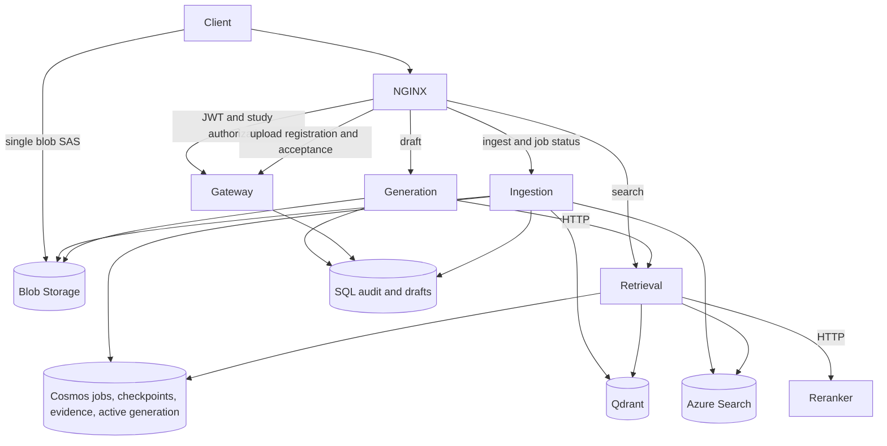

# medwriter-assist

A medical-writing application with functioning upload, ingestion, retrieval,
drafting and acceptance workflows. The installed models are deterministic
placeholders. They exercise the infrastructure and preserve source provenance;
they do not provide medical interpretation or verification.

`backend=local|azure` selects infrastructure adapters. Both environments run the
same application and placeholder processing. There is no separate demonstration
mode, workflow or version axis. Azure OpenAI and other remote model adapters are
retained for later integration but are not constructed or provisioned now.

This README is the project documentation. The two Markdown files under
`services/generation/app/prompts/` are application templates. Historical and
current verification records live in [docs/verification.json](docs/verification.json).
Each record identifies its own tested artifacts; older results are not evidence
that a later build has passed the same exercise.

## Current state

The application workflow has passed an isolated container exercise with all five
services and real Qdrant: two uploads, persistent jobs, interrupted publication,
worker restart, checkpoint recovery, retention of previously ingested documents,
HTTP retrieval/reranking, streamed output, durable audit and acceptance. The
exercise uses SQLite and files for the local infrastructure adapters and signed
test JWTs. It does not establish Azure storage, Entra, SQL, pipeline or AKS behavior.

A separate real SQL Server container exercise passed the five migrations,
idempotent indexing audit, draft persistence and acceptance. Runtime principals
were denied audit updates and deletes. Azure SQL authentication remains part of
cloud commissioning.

Azure commissioning uses the normal `dev` configuration and the deployment tools
below. A successful cloud acceptance report must demonstrate the actual Azure
services and release transitions; an implemented command or rendered manifest
alone does not meet that requirement. Current run results and outstanding
commissioning checks are recorded in the verification JSON.

The existing `medw` minikube installation and its persistent volumes are preserved.
Its application images remain pinned to the earlier NGINX cutover release
`8be19924b30edc325c2525f2439b5c1e3a62a044`. It is not silently relabelled as this
new application release. Its Qdrant image remains explicitly pinned to 1.12.1
until a separate backed-up storage upgrade. New deployments use Qdrant 1.19.0,
aligned with the installed client.

## Local development

Requires Python 3.11+, Docker, Helm and kubectl. Service images use Python 3.11
with exact hash-checked dependencies; the host environment resolves development
requirements separately.

```sh
make dev
source .venv/bin/activate
make check
make up-full
# After stopping the foreground process:
make down
```

`make up` starts Qdrant, retrieval and reranker; `make up-full` adds gateway,
generation and ingestion. SQLite state and immutable artifacts persist in the
`platform_state` volume; Qdrant has its own volume. `make down` preserves both.
No Azure credentials are required. `.env.example` supplies host-run settings;
Compose supplies its own adapter and container-address settings.

| Service | Local host port | Responsibility |
|---|---|---|
| Gateway | 8000 | JWT/study access, upload registration, documents, acceptance |
| Retrieval | 8001 | One generation selection, both indexes, fusion, HTTP reranking |
| Reranker | 8002 | Deterministic lexical scoring over HTTP |
| Generation | 8003 | JWT actor, HTTP retrieval, streamed output, audit and draft persistence |
| Ingestion worker | 8004 | Registered upload submission, durable polling, stages and publication |

Compose exposes diagnostic ports on localhost and does not run the Kubernetes
NGINX controller. Retrieval and ingestion rely on the deployed edge and enforced
NetworkPolicies for public study authorization. Do not publish their diagnostic
ports externally. Gateway and generation additionally verify writer JWTs and
membership themselves. Configure an identity provider and seed membership for
manual writer requests; the disposable verification harness supplies its own
signing keys and membership without changing the application authentication code.

```sh
python scripts/build_images.py --tag application-proof
python scripts/verify_application.py --image-tag application-proof
```

The harness creates and removes its own Compose project and volumes. It writes
machine-readable evidence under `/tmp`. A dirty source build is explicitly
unversioned and cannot serve as a published release.

For the real NGINX/NetworkPolicy proof, use a fresh disposable profile:

```sh
export KUBECONFIG=/tmp/medw-nginx-proof.kubeconfig
minikube start -p medw-nginx-proof --driver=docker --kubernetes-version=v1.35.1 --cni=calico --cpus=4 --memory=6144 --keep-context
kubectl --context medw-nginx-proof wait --for=condition=Ready nodes --all --timeout=180s
python scripts/verify_ingress.py --image-tag application-proof
minikube delete -p medw-nginx-proof
unset KUBECONFIG
```

The harness removes its application namespaces even on failure; delete the
disposable profile afterward. Its fixed context prevents targeting `medw`.

Every service has `/healthz`, `/readyz`, `/version` and `/metrics`. Readiness probes
the dependencies it actually uses: a working placeholder reranker is ready without
Azure model resources; a storage outage remains visible. Generation also checks
retrieval, and retrieval checks reranker. The gateway does not depend on backend
availability to make access decisions. Existing `synthetic_enabled` controls only
the local diagnostic `/_synthetic/work` route and identity-provider readiness;
it neither selects the application implementation nor bypasses JWT validation.

## Architecture and application contract



1. Authenticated `POST /studies/{study}/documents:upload-url` accepts
   `{filename,size_bytes,sha256,doc_id?}` and registers an upload. Files must be
   nonempty and at most 5 MiB. Azure returns a short-lived, create-only user
   delegation SAS for one staging blob. The client uploads directly to Blob.
   Local storage provides an equivalent expiring capability URL. Neither URL nor
   its token belongs in logs or evidence reports.
2. Authenticated `POST /studies/{study}/documents/{document}/ingest` accepts
   `{upload_id,idempotency_key}` and returns `202` with a durable job ID. Arbitrary
   download URLs are not accepted. Size and SHA-256 are checked, an Azure ETag
   protects the read, and immutable source bytes are captured before acknowledgment.
   Repeated matching submissions return the same job, including after SAS expiry;
   reusing a key for different input is rejected.
3. `GET /studies/{study}/jobs/{job}` reports persisted progress. The worker polls
   durable jobs, leases them, renews leases and saves immutable stage checkpoints.
   Per-study serialization prevents overlapping publication. Restart recovery
   retains the job's generation identity and skips committed stages.
4. A study generation includes the newest revision of every previously published
   document. The worker stages both indexes, reads back counts and payload hashes,
   retains evidence and conditionally replaces one active manifest. Partial
   publication leaves the old generation selected. SQL indexing audit and document
   metadata are idempotent across a crash after publication.
5. `POST /studies/{study}/search` accepts `{query,top_k,...filters}`. The path owns
   study scope; forged identity/study body fields are rejected. Retrieval selects
   one compatible manifest, queries both indexes, fuses ranks and calls reranker
   over HTTP. Citations identify immutable source revisions and locations.
6. `POST /studies/{study}/sections/{section}/draft` accepts
   `{query,top_k?,max_tokens?}`. Generation validates the JWT actor and membership,
   retrieves over HTTP, checks returned text against retained evidence and streams
   NDJSON `start`, `delta`, then `complete`. **Only `complete` confirms the audit
   and draft reference were persisted.** An `error` or interrupted stream is not
   a committed draft. Verification explicitly reports `not_performed`.
7. `POST /studies/{study}/sections/{section}/accept` accepts `{draft_id}` and
   transitions that specific draft under the authenticated writer. The SQL
   procedure atomically records acceptance and changes status. It cannot mutate
   the original generation audit. Same-writer repeat acceptance is idempotent.

## Installed processing and deliberate gaps

| Component | Current implementation / identity |
|---|---|
| Extraction | `placeholder-text-1`: bytes preserved; bounded UTF-8 decoding or binary fallback |
| Classification/annotation | Explicit stand-ins, no medical validation or entities |
| Embeddings | `token-hash`, version `1`, deployment/compatibility `hash-1`, 64 dimensions |
| Fusion/reranking | Reciprocal rank fusion and deterministic lexical overlap |
| Generation | `scripted-placeholder`, version `1`, deployment `scripted-chat` |
| Verification | Explicit `not_performed`; no clinical correctness claim |

Extraction processes at most 64,000 decoded characters, split into 1,000-character
chunks. This is an intentional parsing limit, recorded in the artifact; all
original bytes remain preserved. Filename and SHA-256 appear in chunk text, so
arbitrary binary inputs also influence retrieval and output. Document type is a
placeholder label. Prompt content affects the emitted input/prompt hash.
Extraction and classification call their installed interfaces. The classifier
receives an explicitly synthetic envelope with no table cells and returns
`other`, confidence zero. The legacy `tfl` document category is a temporary
storage label, not a predicted document type. Checkpoints record the classifier
actually called; older checkpoints without that call are marked `not-run`.

Airflow batch ingestion and reindexing come next, reusing
[ingestion.py](libs/medw_core/ingestion.py) operations. Real model implementations
can then replace placeholders one at a time behind the existing interfaces.
Medical parsing, numerical fidelity, clinical evaluation/golden datasets, a
frontend, client rules, automatic evidence-retention policy and multi-node
availability are outside this increment. The older implementation branch
`implementation/retrieval-slice` (`089dd50`) is reference material, not code to copy
wholesale over the current durability and provenance contracts.

## Major decisions and corrected errors

- One `Settings` class remains. Optional Azure settings use `str | None`; clients
  require only fields they use. The earlier subclasses added validation without
  separating attributes and were removed. Configuration selects infrastructure,
  while installed model identities are checked against packaged code.
- NGINX owns forwarding and streaming. The gateway supplies small body-free
  authorization subrequests and writer operations. The five-service boundary is
  retained; streaming alone is not an argument for a separate generation service.
- Real Azure stores and local adapters share ports. Protocols describe contracts;
  service composition wires only needed dependencies. Readiness proves reachability
  and installed implementation availability rather than object construction.
- Immutable source evidence is independent of serving indexes. Revision identity
  includes study, logical document and content hash. Reindexing cannot discard
  citations or rewrite historical audit provenance.
- One conditional manifest coordinates Qdrant and Search; there is no cross-store
  transaction. Readback verifies content, not just IDs. Stable generation plans,
  expiring leases and idempotent audit writes resolve restart/publication gaps.
- Cosmos holds changing state; SQL holds relational registry, membership, drafts
  and append-only audit. Evidence retention precedes audit insertion; a failed SQL
  write can leave conservative references, but cannot remove cited evidence.
- Generation derives the actor from a validated JWT. Correlation IDs propagate
  through HTTP, queued work, traces and audit. Client-supplied actor fields are
  rejected. Release A audit rows retain A's identity after B is deployed.
- Runtime identities receive narrowly scoped data permissions; migration identity
  alone has DDL authority. Migration 0005 adds draft/acceptance persistence and
  narrows generation audit grants without rewriting migrations 0001–0004.
- Python forwarding, in-memory-only jobs, placeholder 501 handlers and required
  unused Azure AI services were removed from the active workflow. False medical
  verification and attribution to Azure OpenAI are not used for placeholder output.
- Qdrant 1.19 removed the older write-lock API. Single-node backups use native
  snapshots and verify the collection set and content before and after capture.
  Modern multi-peer backups require coordinated writer quiescence and currently
  refuse to run; multi-node availability remains outside this increment.

## Azure commissioning

Install Azure CLI, Docker, kubectl, Helm, Flux and OpenSSL, then run `az login`
and select the intended subscription with `az account set --subscription ID`.
The operator needs resource creation and role-assignment permissions, plus
permission to register Entra applications. Preflight reports missing access.

For a fresh Azure DevOps setup, create an organization/project, then open
**Project settings → Service connections → New service connection → GitHub**.
Use OAuth to authorize the repository and save the connection as `medw-github`.
Copy its connection ID from its settings URL into `devops.github_service_connection_id`;
set `devops.organization` and `devops.project` in the same configuration. Setup
creates the Azure federation connection and pipeline. Browser authorization and
the later API browser sign-in are the interactive steps; no password or token is
needed in chat or the configuration file.

Use one ignored configuration file, initially copied from
[infra/azure.example.json](infra/azure.example.json):

```sh
mkdir -p data/azure
cp infra/azure.example.json data/azure/config.json
# Fill configuration once; commands below reuse it.
make azure-preflight
make azure-up
make demo-run FILE=/absolute/path/to/a/file
make azure-verify
make azure-down
```

`AZURE_CONFIG=/path/to/config.json` overrides the same file for every command.
The configuration identifies subscription, location, dedicated owned resource
group, optional borrowed Search/Cosmos resource IDs, separate application
index/database names, study membership and Azure DevOps organization/project.
The current project is `https://dev.azure.com/gzwhbosons/medwriter-assist`.
Passwords, SAS tokens and service credentials do not belong in that file or Git.

| Command | Behavior |
|---|---|
| `azure-preflight` | Access, provider registration, VM capacity/quota, borrowed resource compatibility, nonbillable build-access proof and current price estimate; blocks paid creation on failure |
| `azure-up` | Journalled resource creation, schema/membership setup, Entra/workload identities, controller/TLS/telemetry, pipeline and initial Flux release |
| `demo-run FILE=…` | Normal authenticated upload-to-acceptance API workflow; verifies stream completion and saves evidence |
| `azure-verify` | Actual deployment/recovery/observability/delivery checks, evidence export and teardown on success or failure; unperformed checks cannot count as passed |
| `azure-down` | Deletes journalled owned resources and application test data; preserves borrowed accounts and unrelated experiments |

The initial sizing is AKS Free, one `Standard_D4s_v5` node without node autoscaling,
ACR Basic, a small SQL database, one Qdrant replica and small disks. Application
scaling is capped at two replicas. Pinned NGINX, Flux, KEDA and Prometheus are
installed; bounded telemetry goes to Application Insights. Azure OpenAI, Document
Intelligence, Language, Azure ML and Container Apps are omitted.

Compatible free Search/Cosmos accounts can be borrowed through resource IDs,
including another accessible subscription. Their account-wide settings and
existing experiments are preserved. Newly created paid infrastructure belongs in
the dedicated resource group. The ownership journal supports reruns and teardown;
do not delete it before removing resources. A$20 is a planning target managed
through current estimates, short sessions and teardown, not a guaranteed cap.
Budget alerts do not stop all charges. Teardown and any remaining resources must
be recorded even when verification fails.
Successful public retail quotes are cached by region and currency for at most
24 hours, with their original timestamp reported. Rate limiting triggers bounded
retries; missing or stale prices block provisioning.

Azure SQL uses an Entra administrator for initial schema/principal setup. The
pipeline uses a separate federated deployment identity; workloads use separate
managed identities. SQL Proxy policy matches allowed TCP 1433 egress.
For this initial exercise, the SQL firewall permits Azure-origin connections
using `AllowAzureServices`; Entra authentication and SQL grants still control
access. This is broader than a private endpoint or a fixed outbound-IP allowlist.
Setup creates the API registration and seeds explicit study membership as an
administrative operation. The API client uses browser sign-in with PKCE and a
localhost callback. It keeps a private MSAL cache in the ignored deployment
directory; teardown removes that cache. A locally supplied `MEDW_DEMO_TOKEN` is
also supported. Optional `api_login_method: "device"` suits headless clients when
tenant policy permits it. This tenant rejected device sign-in with error 530035;
normal browser sign-in passed without changing security settings.

The load balancer uses an Azure-provided DNS label. Setup generates a certificate
for that hostname and stores its trust certificate under the private deployment
state directory. The client explicitly trusts that certificate and still verifies
hostnames; TLS verification is never disabled. Public Azure Blob uploads use the
normal certificate trust store.

The GitHub service connection requires browser authorization for the existing
repository. Azure Resource Manager uses workload identity federation, avoiding a
stored deployment password. Hosted build capacity is checked; configuration also
supports an explicit local agent pool. Never silently purchase hosted capacity.
The initial capacity check runs a temporary pipeline that proves checkout and
push access on a disposable branch. It may send Azure DevOps build notifications;
its pipeline and branch are then removed, while the result remains in the local
build-capacity evidence file. The real delivery pipeline is created during setup.

## Releases and versioning

A complete release contains all five image digests and full source SHAs, immutable
chart source revision, model names/versions, embedding compatibility/dimensions,
content-derived prompt hash and canonical bundle hash. Runtime
`deployment_revision` hashes effective Helm values, including secret references;
it is not another claimed Git revision. Changing a prompt changes the packaged
prompt hash and resulting output. Models are checked against the installed code;
ARM deployment checks become relevant when remote Azure adapters are wired in.

Register `deploy/azure-pipelines/delivery.yml` as the automatic pipeline. It checks
code/charts, builds and smokes five images, publishes to ACR, verifies packaged
identity, applies migrations and commits the release selection. Code, prompts,
charts and behavior changes trigger work. Selection commits only touch release
records/Flux configuration and do not trigger a build loop.

Cloud overlays separate `environment-values.yaml` (infrastructure) from
`release-values.yaml` (selected artifacts). Flux owns application Helm releases.
`medwriter-release-charts` pins chart Git source. Promotion and rollback reuse
existing images; do not manually `helm upgrade` Flux-owned applications.

```sh
python scripts/verify_release.py bundle.json --registry REGISTRY --environment dev
python scripts/check_model_deployments.py bundle.json --environment dev
# Preview or select locally:
python scripts/release.py select bundle.json --environment dev
# Intentional Git release selection; existing artifacts, no rebuild:
python scripts/commit_release.py bundle.json --environment dev --branch main --push --allow-rollback
```

`commit_release.py` uses an isolated checkout, retries concurrent Git updates,
rejects stale promotions and records bundles under `deploy/releases/`. SQL
migrations are ordered, checksummed, serialized and transactional; append new
migrations rather than editing historical files. Token-based migration execution
uses `MEDW_SQL_ACCESS_TOKEN`, `MEDW_SQL_SERVER` and `MEDW_SQL_DATABASE`; the existing
connection-string option remains available for isolated SQL verification.

Python locks are per service and installed with `--require-hashes --no-deps`.
Refresh deliberately with the pinned lock tool. After a `medw-lib` version change,
update all consumers and regenerate `Chart.lock` using `helm dependency update`.
Routine checks use `helm dependency build`.

## Ingress and operational signals

The maintained F5 NGINX OSS controller is pinned in `deploy/nginx-ingress.yaml`
(controller 5.6.1, chart 2.7.1), with class `medw-nginx`. This is distinct from the
retired community ingress-nginx controller. Gateway's chart owns VirtualServer
routes and external-auth Policies. The controller overwrites `X-Original-URI`
and `X-Original-Method`; gateway rejects ambiguous encodings before membership
checks. Auth subrequests cover jobs, ingestion, search and drafting.

Unknown paths, internal `/search`, authorization routes, OpenAPI, probes and
metrics are private. Buffering and automatic upstream POST retries are disabled.
Terminating application pods wait five seconds before Uvicorn receives its stop
signal, allowing NGINX to remove the old endpoint before connections are refused.
The read timeout is 300 seconds between upstream reads. TLS terminates at NGINX.
Only trusted operators may edit snippet-enabled controller resources.

NetworkPolicies select controller namespace and pod labels together. Generation
may call retrieval, retrieval may call reranker, and ingestion/retrieval may call
Qdrant. The monitoring namespace is trusted for scraping. AKS uses an enforcing
Cilium overlay; private Azure endpoints need explicit additional egress rules.

Prometheus exports request counts/durations/in-flight work. KEDA uses the actual
in-flight gauge. OpenTelemetry propagates trace and correlation IDs and attaches
release provenance. A failed probe withdraws a backend, while `/healthz` remains
available for diagnosis. Qdrant snapshots belong in Blob and must be restored to
separate storage for verification; replicas alone are not a backup.

The existing local cluster is `medw`, at `http://192.168.49.2:30080/version`, with
Calico and NGINX NodePorts 30080/30443. Its original state and Qdrant PVC bindings
are retained. Dedicated verification harnesses must never target this installation.

## Verification and file walkthrough

`make check` runs Ruff, mypy, import contracts, tests, six chart renders, five Flux
configurations and the pinned NGINX controller contract. It needs network access
to fetch the official controller chart. Tests include signed JWTs, forged identity
rejection, lease/checkpoint races, interrupted dual-index publication, immutable
evidence, audit failure, specific draft acceptance and retained revisions.

[docs/verification.json](docs/verification.json) retains historical real SQL,
Qdrant backup/restore, enforced NetworkPolicy, Flux rollout/rollback and KEDA
proofs. Those historical exercises use their recorded versions and are not a
substitute for current Azure acceptance. New evidence excludes credentials and
SAS URLs, and records resource references, hashes, job/audit IDs, release identity,
cleanup and explicit failed or unverified checks.

For a code walkthrough, start with settings, schemas and ports, then composition
and service lifespan. Follow gateway authentication/upload, `uploads.py`,
`durable_jobs.py`, `ingestion.py`, `sources.py` and `indexing.py`. Continue through
retrieval, reranker, generation, audit and `drafts.py`. Finish with database
migrations, image/release scripts, Helm/Flux/NGINX and the Azure operator scripts.
