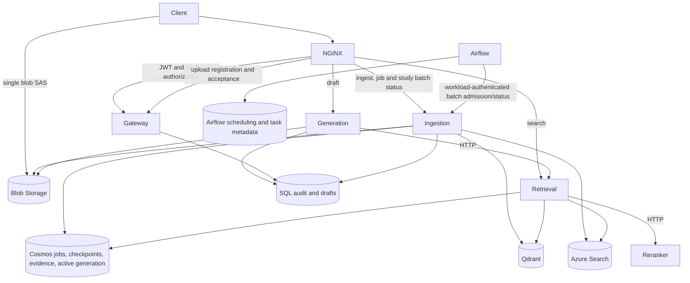

# medwriter-assist

A medical-writing application with functioning upload, ingestion, retrieval,
drafting and acceptance workflows. The installed models are deterministic
placeholders. They exercise the infrastructure and preserve source provenance;
they do not provide medical interpretation or verification.

Azure is the only supported application deployment. The installed placeholder
processing runs against real Azure stores and Qdrant. Offline tests inject small
storage and model doubles from `tests/support`; these are not installed in service
images or selectable through application configuration. There is no separate
demonstration mode, workflow or version axis. Azure OpenAI and other remote model
adapters are retained for later integration but are not constructed or provisioned now.

This README is the project documentation. The two Markdown files under
`services/generation/app/prompts/` are application templates. Historical and
current verification records live in [docs/verification.json](docs/verification.json).
Each record identifies its own tested artifacts; older results are not evidence
that a later build has passed the same exercise.

## Current state

Before retirement of the local deployment option, the application workflow passed
an isolated container exercise with all five services and real Qdrant: two uploads, persistent jobs, interrupted publication,
worker restart, checkpoint recovery, retention of previously ingested documents,
HTTP retrieval/reranking, streamed output, durable audit and acceptance. The
exercise used SQLite and files for the former local infrastructure adapters and
signed test JWTs. It does not establish Azure storage, Entra, SQL, pipeline or
AKS behavior.

A separate real SQL Server container exercise passed the five migrations,
idempotent indexing audit, draft persistence and acceptance. Runtime principals
were denied audit updates and deletes. Azure SQL authentication was subsequently
exercised during cloud commissioning.

Initial Azure commissioning succeeded on 16 September 2026. Azure Pipelines run 6
built, tested, published and selected the release; Flux brought all five services
and Qdrant to Ready. Real Entra-authenticated HTTPS requests passed, an
unauthenticated request was rejected, and a binary file uploaded directly to Blob
completed durable ingestion and indexing. Azure SQL initialization and federated
pipeline migrations also passed. The host checks at commissioning passed 334 tests.
Checks for the subsequent retirement of local deployment are recorded under
`azure-only-cleanup` and `backend-setting-removal` in the verification JSON.

The Azure exercise resumed from a cold start on 17 September 2026, using the
Azure-only source. Binary and text files completed upload, durable ingestion,
retrieval, streamed drafting, SQL audit and acceptance. Previously ingested
documents remained searchable. Worker/publication recovery, Qdrant persistence,
Blob snapshot restore, authentication rejections and correlated traces passed.
Azure Pipelines runs 8 and 9 published releases A and B; Flux/Helm applied the
upgrade, remediated a deliberately failed deployment and rolled back to A.
Earlier SQL audit identities remained unchanged.

All twelve acceptance areas have passing observations across the run and targeted
rechecks. The original suite and unsuccessful rechecks are retained, not relabelled
as passes; a single uninterrupted green suite was not rerun after the verifier
corrections. The final bounded scaling check completed 470 drafts with zero failed
requests and observed one, two, then one generation replica. The verification JSON
records the tested releases, corrections, individual evidence and cleanup outcome.
Owned Azure resources, the managed node group, temporary DevOps objects and API
registrations were removed afterwards. Borrowed free-tier account settings and
the stopped local installation were preserved.

Nightly Airflow ingestion is now implemented, with a configurable 02:00
Australia/Brisbane schedule. Offline tests exercise deferred submission, frozen
batch membership, retries, revision ordering and access control. The packaged DAG
also runs against a real disposable PostgreSQL database, with loopback identity
and ingestion API fixtures. These checks do not establish a deployed Airflow
installation: its AKS startup, real workload-token exchange and overnight run
remain to be verified in Azure. The earlier twelve-area Azure result predates
this addition; the acceptance suite now includes a thirteenth, Airflow batch check.

The retired `medw` minikube installation remains stopped, with its original data
and volumes preserved. Its historical application source is
`8be19924b30edc325c2525f2439b5c1e3a62a044` and its Qdrant image is 1.12.1.
Removing local deployment support does not migrate, restart or delete that
installation. Current Azure deployments use Qdrant 1.19.0.

## Development and offline tests

Requires Python 3.11+; full checks also use Helm 3.19+ and kubectl. Service images use
Python 3.11 with exact hash-checked dependencies; the host environment resolves
development requirements separately.

```sh
make dev
source .venv/bin/activate
# Focused tests: no Azure credentials, deployment or running services required.
pytest tests/test_ingestion_workflow.py tests/test_application_workflow.py tests/test_auth.py -q
# Full host checks, including chart rendering:
make check
```

The shared application operations are tested with SQLite, temporary files,
signed test JWTs and embedded Qdrant. These tests cover checkpoints, restarts,
publication, retrieval/reranking HTTP calls, streamed output, audit and acceptance.
Azure composition tests replace external client boundaries and exercise the real
wiring and dependency probes. SDK adapter tests verify Azure requests separately.
Offline tests do not establish live Azure permissions, availability or behavior.

`tests/support` contains only test dependencies. Tests import them explicitly;
there is no alternate composition root or test-mode switch in the application.
There is no backend selector in settings, deployment configuration or `/version`.
Azure dependencies are wired directly. Obsolete local settings can be removed
from an existing per-machine `.env`.
Compose, local Flux overlays, local service values, minikube application harnesses
and the `make up`, `up-full`, `up-legacy` and `down` targets have been retired.

With Docker available, check all packaged images without deploying Azure:

```sh
python scripts/build_images.py --tag startup-check
```

The five application images start temporarily with networking disabled and dummy Azure endpoint
configuration. Its actual Azure adapters must initialize; missing infrastructure
must keep readiness at 503. A versioned placeholder reranker can be ready without
external stores. Telemetry uses loopback destinations and cannot leave the
container. Smoke containers are removed on success and failure. Uncommitted
builds are marked `unversioned` and cannot become published releases.

The sixth image packages Airflow and the active ingestion DAG. Its smoke check
uses an isolated Docker network, disposable PostgreSQL, and loopback identity/API
fixtures. It executes successful and failed DAG runs and tests operator-account
creation on a rerun. It does not deploy an alternate application. To check only it:

```sh
python scripts/build_images.py --service airflow --tag batch-check
```

For a browser-controlled cloud walkthrough, `scripts/cloud_demo.py` runs an API
client as a temporary AKS Job using the selected ingestion image. Its separate
`demo-client` workload identity receives membership in the configured test study,
with no direct Blob/Cosmos/Search/SQL grants. Audit attributes its actions to that
machine identity. The client uses normal authenticated public APIs and explicitly
trusts the deployment certificate; there is no alternate application mode.

Each of the five application services has `/healthz`, `/readyz`, `/version` and `/metrics`, listening on
port 8000 inside its container. Readiness probes the dependencies actually used.
Generation also checks retrieval, and retrieval checks reranker. Gateway access
decisions do not depend on the availability of those downstream services.

| Service | Responsibility |
|---|---|
| Gateway | JWT/study access, upload registration, documents, acceptance |
| Retrieval | One generation selection, both indexes, fusion, HTTP reranking |
| Reranker | Deterministic lexical scoring over HTTP |
| Generation | JWT actor, HTTP retrieval, streamed output, audit and draft persistence |
| Ingestion worker | Registered upload submission, durable polling, stages and publication |

Airflow is a separate scheduler/API/DAG-processor installation using its upstream
health probes and StatsD metrics. Its task processes call the ingestion worker;
they do not host another copy of the document-processing implementation.

## Architecture and application contract



1. Authenticated `POST /studies/{study}/documents:upload-url` accepts
   `{filename,size_bytes,sha256,doc_id?}` and registers an upload. Files must be
   nonempty and at most 5 MiB. Azure returns a short-lived, create-only user
   delegation SAS for one staging blob. The client uploads directly to Blob.
   The SAS URL and its token do not belong in logs or evidence reports.
2. Authenticated `POST /studies/{study}/documents/{document}/ingest` accepts
   `{upload_id,idempotency_key,processing?}` and returns `202` with a durable job ID.
   `processing` is `immediate` by default or `nightly`. Arbitrary
   download URLs are not accepted. Size and SHA-256 are checked, an Azure ETag
   protects the read, and immutable source bytes are captured before acknowledgment.
   Repeated matching submissions return the same job, including after SAS expiry;
   reusing a key for different input or processing choice is rejected. A first
   submission must occur before the upload registration expires, including for
   nightly work; the SAS itself need not remain valid until morning.
3. `GET /studies/{study}/jobs/{job}` reports persisted progress. The worker polls
   durable jobs, leases them, renews leases and saves immutable stage checkpoints.
   Per-study serialization prevents overlapping publication. Restart recovery
   retains the job's generation identity and skips committed stages. Immediate
   jobs enter `queued`; nightly jobs remain `scheduled` until Airflow admits them.
   The returned job then includes a `batch_id`. Authenticated
   `GET /studies/{study}/batches/{batch}` reports that study's counts and jobs
   without disclosing another study's inputs.
4. A study generation includes the newest revision of every previously published
   document. The worker stages both indexes, reads back counts and payload hashes,
   retains evidence and conditionally replaces one active manifest. Partial
   publication leaves the old generation selected. SQL indexing audit and document
   metadata are idempotent across a crash after publication.
5. `POST /studies/{study}/search` accepts `{query,top_k,...filters}`. The path owns
   study scope; forged identity/study body fields are rejected. Retrieval selects
   one compatible manifest, queries both indexes, fuses ranks and calls reranker
   over HTTP. Citations identify immutable source revisions and locations.
6. `POST /studies/{study}/sections/{section}/draft` accepts
   `{query,top_k?,max_tokens?}`. Generation validates the JWT actor and membership,
   retrieves over HTTP, checks returned text against retained evidence and streams
   NDJSON `start`, `delta`, then `complete`. **Only `complete` confirms the audit
   and draft reference were persisted.** An `error` or interrupted stream is not
   a committed draft. Verification explicitly reports `not_performed`.
7. `POST /studies/{study}/sections/{section}/accept` accepts `{draft_id}` and
   transitions that specific draft under the authenticated writer. The SQL
   procedure atomically records acceptance and changes status. It cannot mutate
   the original generation audit. Same-writer repeat acceptance is idempotent.

### Immediate and nightly processing

A future frontend uses the same upload sequence for either choice: register the
upload, PUT the bytes to Blob, then submit the ingest request with the chosen
`processing` value. It can poll the job ID. `immediate` means eligible for the
worker now; the HTTP request still returns before processing finishes.

At 02:00 Brisbane time, `pipelines/dags/ingest_study.py` freezes a batch of the
oldest eligible nightly submissions, releases them to the existing durable
worker, waits without occupying a task slot, and reports the combined outcome.
The deployment configuration's `batch` object controls `hour`, `minute`,
`timezone` and `max_documents` (default 500, maximum 1,000). Inputs arriving after
the scheduling boundary and any backlog beyond the limit wait for the next run.
Missed nights are covered by selecting all older pending inputs, without a lower
date boundary. Only one run of this DAG is active at a time.

Batch membership is persisted in Cosmos before admission. A retried task resumes
that selection instead of discovering a different set of files. Airflow stores
its own schedule and task history in PostgreSQL; document checkpoints and outcomes
remain in Cosmos and indexing audit remains in SQL. The batch coordinator uses
an Entra workload identity, not a writer's browser session. Its private endpoints
accept only the configured machine principal. Writer endpoints also check JWTs
and study membership inside ingestion, in addition to NGINX authorization.

Started work recovers first; immediate jobs then take priority over unstarted
nightly jobs. Publication remains serialized per study. An older deferred revision
is marked `superseded` if a newer submission for the same document has already
completed. Successful documents remain published if another batch member fails;
this is not an all-or-nothing transaction across the batch. A failed document
makes the DAG fail. Retrying Airflow tasks does not reset terminal document
failures; after correcting their cause, submit again with a new idempotency key.
The batch report counts completed, failed and superseded documents explicitly.

For an operator-triggered run of the same DAG, use the private Airflow UI or
`airflow dags trigger ingest_study` inside its scheduler container. No separate
manual processing implementation is needed. `make demo-run FILE=… PROCESSING=nightly`
uploads and records the scheduled job, then returns without waiting overnight or
drafting. The default command continues through ingestion, drafting and acceptance.

## Installed processing and deliberate gaps

| Component | Current implementation / identity |
|---|---|
| Extraction | `placeholder-text-1`: bytes preserved; bounded UTF-8 decoding or binary fallback |
| Classification/annotation | Explicit stand-ins, no medical validation or entities |
| Embeddings | `token-hash`, version `1`, deployment/compatibility `hash-1`, 64 dimensions |
| Fusion/reranking | Reciprocal rank fusion and deterministic lexical overlap |
| Generation | `scripted-placeholder`, version `1`, deployment `scripted-chat` |
| Verification | Explicit `not_performed`; no clinical correctness claim |

Extraction processes at most 64,000 decoded characters, split into 1,000-character
chunks. This is an intentional parsing limit, recorded in the artifact; all
original bytes remain preserved. Filename and SHA-256 appear in chunk text, so
arbitrary binary inputs also influence retrieval and output. Document type is a
placeholder label. Prompt content affects the emitted input/prompt hash.
Extraction and classification call their installed interfaces. The classifier
receives an explicitly synthetic envelope with no table cells and returns
`other`, confidence zero. The legacy `tfl` document category is a temporary
storage label, not a predicted document type. Checkpoints record the classifier
actually called; older checkpoints without that call are marked `not-run`.

Nightly Airflow ingestion reuses [ingestion.py](libs/medw_core/ingestion.py)
operations. Scheduled backfill/reindexing remains future work. Real model
implementations can replace placeholders one at a time behind the existing interfaces.
Medical parsing, numerical fidelity, clinical evaluation/golden datasets, a
frontend, client rules, automatic evidence-retention policy and multi-node
availability are outside this increment. The older implementation branch
`implementation/retrieval-slice` (`089dd50`) is reference material, not code to copy
wholesale over the current durability and provenance contracts.

The stubs in `pipelines/` (including the CLI, parsers and `backfill_reindex.py`), `ml/`,
`evals/`, and generation's table rendering and clinical verification functions
remain intentional future work. They are retained even where no active runtime
imports them. Only the implemented `ingest_study` DAG is installed in Airflow.
`make seed` and `make eval` still name those unfinished entrypoints;
they do not currently seed a study or produce evaluation results. Use the Azure
setup and normal upload APIs for the functioning workflow. The inactive Container
Apps example is retained as historical scaffolding and is not an Azure deployment
option supported by the operator commands.

## Major decisions and corrected errors

- One `Settings` class remains. Optional Azure settings use `str | None`; clients
  require only fields they use. The earlier subclasses added validation without
  separating attributes and were removed. Azure is the sole deployment target;
  installed model identities are checked against packaged code.
- NGINX owns forwarding and streaming. The gateway supplies small body-free
  authorization subrequests and writer operations. The five-service boundary is
  retained; streaming alone is not an argument for a separate generation service.
- Azure stores and offline test doubles share ports. Protocols describe contracts;
  service composition wires only needed Azure dependencies. Readiness checks live
  dependencies and installed implementations. SQLite/file helpers live under
  `tests/support` and are excluded from the runtime package. The former local
  upload handler and synthetic work endpoint have been removed.
- Immutable source evidence is independent of serving indexes. Revision identity
  includes study, logical document and content hash. Reindexing cannot discard
  citations or rewrite historical audit provenance.
- One conditional manifest coordinates Qdrant and Search; there is no cross-store
  transaction. Readback verifies content, not just IDs. Stable generation plans,
  expiring leases and idempotent audit writes resolve restart/publication gaps.
- Cosmos holds changing state; SQL holds relational registry, membership, drafts
  and append-only audit. Evidence retention precedes audit insertion; a failed SQL
  write can leave conservative references, but cannot remove cited evidence.
- Generation derives the actor from a validated JWT. Correlation IDs propagate
  through HTTP, queued work, traces and audit. Client-supplied actor fields are
  rejected. Release A audit rows retain A's identity after B is deployed.
- Runtime identities receive narrowly scoped data permissions; migration identity
  alone has DDL authority. Migration 0005 adds draft/acceptance persistence and
  narrows generation audit grants without rewriting migrations 0001–0004.
  Migration 0006 grants ingestion membership reads and appends indexing-audit
  fields for job, batch and original requester identity. Historical migrations
  and append-only audit permissions are preserved.
- Airflow owns scheduling and batch outcomes; the existing durable worker owns
  processing and publication. This keeps immediate and scheduled processing on
  the same implementation. The bounded installation uses LocalExecutor, without
  Redis or a second distributed worker queue.
- Airflow needs a compatible metadata database. Its supported deployment choices
  are PostgreSQL and MySQL; the existing Azure SQL database uses Microsoft SQL
  Server and cannot fill that role. See the
  [official database setup guide](https://airflow.apache.org/docs/apache-airflow/3.3.1/howto/set-up-database.html).
  A PostgreSQL 16 container uses the existing AKS node and a persistent disk; no
  Azure managed PostgreSQL service is provisioned. This single-instance setup
  is for the bounded exercise, without database HA or automated metadata backups.
- Python forwarding, in-memory-only jobs, placeholder 501 handlers and required
  unused Azure AI services were removed from the active workflow. False medical
  verification and attribution to Azure OpenAI are not used for placeholder output.
- Qdrant 1.19 removed the older write-lock API. Single-node backups use native
  snapshots and verify the collection set and content before and after capture.
  Modern multi-peer backups require coordinated writer quiescence and currently
  refuse to run; multi-node availability remains outside this increment.
- Restart verification waits for public retrieval to recover after Qdrant is
  ready; downstream probes and routing updates can still briefly return 503.
  Monitoring verification waits for actual Prometheus samples and uses the
  authenticated Kubernetes service proxy, avoiding a fragile local port-forward.
- The 400 RU/s Cosmos allocation cannot sustain the earlier unpaced eight-client,
  eight-citation load: it produced a real 429 and an uncommitted draft. Scaling
  verification now uses two clients, one citation, a 100 ms pause between requests
  and a fresh connection per draft. Reused connections also failed during an
  earlier scaling run with NGINX worker reloads. No failed draft is retried or
  counted as successful. This bounded proof does not establish production
  throughput or connection continuity during every deployment transition.
- Cleanup checks the recorded DevOps connection ID before deletion. A successful
  authenticated listing can establish that it is already gone; a permission
  failure cannot. This corrects retries that previously treated an already-deleted
  connection as a cleanup failure, while preserving other connections.

## Azure commissioning

Install Azure CLI, Docker, kubectl, Helm 3.19+, Flux and OpenSSL, then run `az login`
and select the intended subscription with `az account set --subscription ID`.
The operator needs resource creation and role-assignment permissions, plus
permission to register Entra applications. Preflight reports missing access.

For a fresh Azure DevOps setup, create an organization/project, then open
**Project settings → Service connections → New service connection → GitHub**.
Use OAuth to authorize the repository and save the connection as `medw-github`.
Copy its connection ID from its settings URL into `devops.github_service_connection_id`;
set `devops.organization` and `devops.project` in the same configuration. Setup
creates the Azure federation connection and pipeline. Browser authorization and
the later API browser sign-in are the interactive steps; no password or token is
needed in chat or the configuration file.

Use one ignored configuration file, initially copied from
[infra/azure.example.json](infra/azure.example.json):

```sh
mkdir -p data/azure
cp infra/azure.example.json data/azure/config.json
# Fill configuration once; commands below reuse it.
make azure-preflight
make azure-up
make demo-run FILE=/absolute/path/to/a/file
make azure-verify
make azure-down
```

`AZURE_CONFIG=/path/to/config.json` overrides the same file for every command.
The configuration identifies subscription, location, dedicated owned resource
group, optional borrowed Search/Cosmos resource IDs, separate application
index/database names, study membership and Azure DevOps organization/project.
The current project is `https://dev.azure.com/gzwhbosons/medwriter-assist`.
Passwords, SAS tokens and service credentials do not belong in that file or Git.

After deployment, the meeting walkthrough can be controlled from Azure Cloud
Shell with Python and kubectl; no local application or localhost login callback
is involved. Obtain AKS credentials for the configured cluster in Cloud Shell,
clone this repository, and run:

```sh
python3 scripts/cloud_demo.py run --processing immediate
python3 scripts/cloud_demo.py run --processing nightly
# Optionally use files uploaded into Cloud Shell instead of generated synthetic documents:
python3 scripts/cloud_demo.py run --processing nightly --file first.txt --file second.txt
```

Immediate processing displays upload/job progress, retrieval and streamed text,
then accepts the persisted draft. The nightly command defaults to two documents,
proves they are deferred, triggers the installed `ingest_study` DAG, and checks
the batch, retrieval and Airflow's final run state. Only the operator triggers
Airflow; the client identity cannot coordinate batches. Files are transferred to
temporary pod storage, then uploaded through the ordinary SAS flow. Evidence is
saved under `data/azure/walkthrough-*.json`, excluding credentials and SAS URLs.
`--kubeconfig PATH` and `--output PATH` are available. Client Jobs are removed on
success or failure; the application remains deployed for the meeting. Use
`azure-down` after the session. The full `azure-verify` command is separate and
still tears the entire owned deployment down.

| Command | Behavior |
|---|---|
| `azure-preflight` | Access, provider registration, VM capacity/quota, borrowed resource compatibility, nonbillable build-access proof and current price estimate; blocks paid creation on failure |
| `azure-up` | Journalled resource creation, schema/membership setup, Entra/workload identities, controller/TLS/telemetry, pipeline and initial Flux release |
| `demo-run FILE=…` | Normal authenticated upload-to-acceptance API workflow; verifies stream completion and saves evidence |
| `demo-run FILE=… PROCESSING=nightly` | Preserves an upload and schedules its durable job for the next Airflow batch |
| `azure-verify` | Actual deployment/recovery/observability/delivery checks, evidence export and teardown on success or failure; unperformed checks cannot count as passed |
| `azure-down` | Deletes journalled owned resources and application test data; preserves borrowed accounts and unrelated experiments |

The initial sizing is AKS Free, one `Standard_D4s_v5` node without node autoscaling,
ACR Basic, a small SQL database, one Qdrant replica and small disks. Application
scaling is capped at two replicas. Pinned NGINX, Flux, KEDA and Prometheus are
installed; bounded telemetry goes to Application Insights. Azure OpenAI, Document
Intelligence, Language, Azure ML and Container Apps are omitted.
The five application services reserve 700 millicores for the installed
placeholders. Airflow and PostgreSQL add approximately 710 millicores and 2.1 GiB
of steady-state memory requests, plus temporary migration/account-creation jobs.
The cost estimate includes four disks: node OS, Qdrant, Airflow metadata and
Airflow logs. Real models and larger batches will need their own sizing.

Airflow 3.3.1 is packaged on the official Helm chart 1.22.0. PostgreSQL metadata
and Airflow logs each have a 4 GiB persistent disk; log grooming retains seven
days. The generated `medw-airflow` Kubernetes Secret holds database credentials,
encryption/signing keys and the operator password. Reruns preserve those keys,
and refuse to adopt a foreign or incomplete Secret. Airflow's UI has no public
route. Operators with Kubernetes access can port-forward
`svc/airflow-api-server` on port 8080 in namespace `medw`, using the deployment's
kubeconfig, and sign in as `admin` with the Secret's `admin-password`. The
PostgreSQL volume is retained when its StatefulSet is deleted; full Azure teardown
removes owned disks with the managed resource group. Moving to a continuously
operated environment requires metadata backups and an appropriate availability plan.

Compatible free Search/Cosmos accounts can be borrowed through resource IDs,
including another accessible subscription. Their account-wide settings and
existing experiments are preserved. Newly created paid infrastructure belongs in
the dedicated resource group. The ownership journal supports reruns and teardown;
do not delete it before removing resources. A$20 is a planning target managed
through current estimates, short sessions and teardown, not a guaranteed cap.
Budget alerts do not stop all charges. Teardown and any remaining resources must
be recorded even when verification fails.
Successful public retail quotes are cached by region and currency for at most
24 hours, with their original timestamp reported. Rate limiting triggers bounded
retries; missing or stale prices block provisioning.

Azure SQL uses an Entra administrator for initial schema/principal setup. The
pipeline uses a separate federated deployment identity; workloads use separate
managed identities. SQL Proxy policy matches allowed TCP 1433 egress.
The delivery user's explicit SQL SID uses its application/client ID; runtime
users are resolved with `FROM EXTERNAL PROVIDER`. Commissioning corrected an
object-ID/client-ID mismatch in the former, with a rerunnable repair checkpoint.
For this initial exercise, the SQL firewall permits Azure-origin connections
using `AllowAzureServices`; Entra authentication and SQL grants still control
access. This is broader than a private endpoint or a fixed outbound-IP allowlist.
Setup creates the API registration and seeds explicit study membership as an
administrative operation. The API client uses browser sign-in with PKCE and a
localhost callback. It keeps a private MSAL cache in the ignored deployment
directory; teardown removes that cache. A locally supplied `MEDW_DEMO_TOKEN` is
also supported. Optional `api_login_method: "device"` suits headless clients when
tenant policy permits it. This tenant rejected device sign-in with error 530035;
normal browser sign-in passed without changing security settings.

The load balancer uses an Azure-provided DNS label. Setup generates a certificate
for that hostname and stores its trust certificate under the private deployment
state directory. The client explicitly trusts that certificate and still verifies
hostnames; TLS verification is never disabled. Public Azure Blob uploads use the
normal certificate trust store.

The GitHub service connection requires browser authorization for the existing
repository. Azure Resource Manager uses workload identity federation, avoiding a
stored deployment password. Hosted build capacity is checked; configuration also
supports an explicit local agent pool. Never silently purchase hosted capacity.
The initial capacity check runs a temporary pipeline that proves checkout and
push access on a disposable branch. It may send Azure DevOps build notifications;
its pipeline and branch are then removed, while the result remains in the local
build-capacity evidence file. The real delivery pipeline is created during setup.

## Releases and versioning

A complete schema-2 release contains six image digests (five application services
plus Airflow/DAGs) and full source SHAs, immutable
chart source revision, model names/versions, embedding compatibility/dimensions,
content-derived prompt hash and canonical bundle hash. Runtime
`deployment_revision` hashes effective Helm values, including secret references;
it is not another claimed Git revision. Changing a prompt changes the packaged
prompt hash and resulting output. Models are checked against the installed code;
ARM deployment checks become relevant when remote Azure adapters are wired in.

Register `deploy/azure-pipelines/delivery.yml` as the automatic pipeline. It checks
code/charts, builds and smokes six images, publishes to ACR, verifies packaged
identity, applies migrations and commits the release selection. Code, prompts,
charts, DAGs and behavior changes trigger work. Selection commits only touch release
records/Flux configuration and do not trigger a build loop.

Cloud overlays separate `environment-values.yaml` (infrastructure) from
`release-values.yaml` (selected artifacts). Flux owns application Helm releases.
`medwriter-release-charts` pins chart Git source. Promotion and rollback reuse
existing images; do not manually `helm upgrade` Flux-owned applications.
Airflow database migration and operator-creation Jobs use release-specific names
so chart-only upgrades can also recreate immutable Jobs. Account creation waits
for migrations; both are ordinary Jobs, avoiding a post-install hook waiting on
pods that themselves need the migration. Historical five-image schema-1 releases
remain readable, but cannot replace an active schema-2 selection: their ingestion
API predates batch processing. Roll back to another complete schema-2 release.
An Airflow major-version/database-schema downgrade would need its own migration
and recovery procedure; ordinary prompt or application rollbacks keep Airflow pinned.

```sh
python scripts/verify_release.py bundle.json --registry REGISTRY --environment dev
python scripts/check_model_deployments.py bundle.json --environment dev
# Preview or select locally:
python scripts/release.py select bundle.json --environment dev
# Intentional Git release selection; existing artifacts, no rebuild:
python scripts/commit_release.py bundle.json --environment dev --branch main --push --allow-rollback
```

`commit_release.py` uses an isolated checkout, retries concurrent Git updates,
rejects stale promotions and records bundles under `deploy/releases/`. SQL
migrations are ordered, checksummed, serialized and transactional; append new
migrations rather than editing historical files. Token-based migration execution
uses `MEDW_SQL_ACCESS_TOKEN`, `MEDW_SQL_SERVER` and `MEDW_SQL_DATABASE`; the existing
connection-string option remains available for isolated SQL verification.

Python locks are per service and installed with `--require-hashes --no-deps`.
Refresh deliberately with the pinned lock tool. After a `medw-lib` version change,
update all consumers and regenerate `Chart.lock` using `helm dependency update`.
Routine checks use `helm dependency build`.

## Ingress and operational signals

The maintained F5 NGINX OSS controller is pinned in `deploy/nginx-ingress.yaml`
(controller 5.6.1, chart 2.7.1), with class `medw-nginx`. This is distinct from the
retired community ingress-nginx controller. Gateway's chart owns VirtualServer
routes and external-auth Policies. The controller overwrites `X-Original-URI`
and `X-Original-Method`; gateway rejects ambiguous encodings before membership
checks. Auth subrequests cover jobs, study batch status, ingestion, search and drafting.

Unknown paths, internal `/search`, authorization routes, OpenAPI, probes and
metrics are private. Buffering and automatic upstream POST retries are disabled.
Terminating application pods wait five seconds before Uvicorn receives its stop
signal, allowing NGINX to remove the old endpoint before connections are refused.
The read timeout is 300 seconds between upstream reads. TLS terminates at NGINX.
Only trusted operators may edit snippet-enabled controller resources.

NetworkPolicies select controller namespace and pod labels together. Generation
may call retrieval, retrieval may call reranker, and ingestion/retrieval may call
Qdrant. Airflow's scheduler may call ingestion's private batch API, with a separate
JWT identity check. Airflow components may reach their PostgreSQL database and
each other; the database has no general application access. The monitoring
namespace is trusted for scraping, including Airflow's StatsD exporter. AKS uses an enforcing
Cilium overlay; private Azure endpoints need explicit additional egress rules.

Prometheus exports request counts/durations/in-flight work. KEDA uses the actual
in-flight gauge. OpenTelemetry propagates trace and correlation IDs and attaches
release provenance. A failed probe withdraws a backend, while `/healthz` remains
available for diagnosis. Qdrant snapshots belong in Blob and must be restored to
separate storage for verification; replicas alone are not a backup.

## Verification and file walkthrough

`make check` runs Ruff, mypy, import contracts, tests, seven chart renders, four Flux
configurations and the pinned NGINX controller contract. It needs network access
to fetch the official controller and Airflow charts. Tests include signed JWTs, forged identity
rejection, lease/checkpoint races, interrupted dual-index publication, immutable
evidence, audit failure, specific draft acceptance, retained revisions and nightly
admission/retry/access-control behavior. Azure acceptance submits two deferred
documents, triggers the real DAG, checks their shared batch and searchable source
identities, and requires Airflow itself to report a successful run. It records the
schedule, job/batch IDs and selected/running Airflow image identity.
Image smoke tests also enable telemetry against loopback endpoints; this catches
missing Azure Monitor packages without sending test telemetry to Azure. The
focused `scripts/verify_qdrant_recovery.py` Docker harness is retained for its
pinned historical storage contract; it does not deploy the application or replace
current Azure backup/restore acceptance.

[docs/verification.json](docs/verification.json) retains historical real SQL,
Qdrant backup/restore, enforced NetworkPolicy, Flux rollout/rollback and KEDA
proofs. Those historical exercises use their recorded versions and are not a
substitute for current Azure acceptance. New evidence excludes credentials and
SAS URLs, and records resource references, hashes, job/audit IDs, release identity,
cleanup and explicit failed or unverified checks.

For a code walkthrough, start with settings, schemas and ports, then composition
and service lifespan. Follow gateway authentication/upload, `uploads.py`,
`durable_jobs.py`, `ingestion.py`, `sources.py` and `indexing.py`. Follow `batches.py`,
`pipelines/batch_client.py` and `pipelines/dags/ingest_study.py` for nightly work. Continue through
retrieval, reranker, generation, audit and `drafts.py`. Finish with database
migrations, image/release scripts, Helm/Flux/NGINX and the Azure operator scripts.
