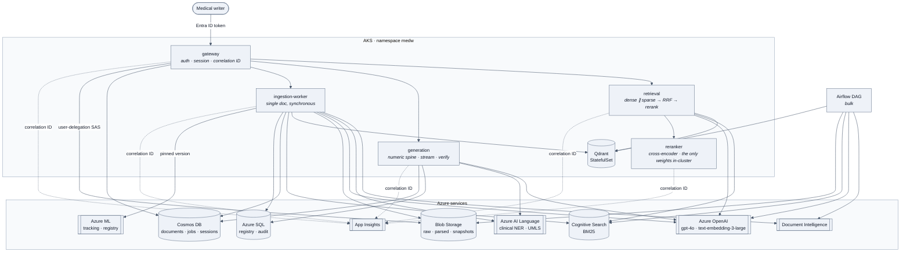

# Architecture — every service, every store, and what touches what

Five application services, six backing stores, two entry points into
ingestion. Nothing here is exotic; the interesting parts are the boundaries.

## The whole picture

## Who talks to what, and why

| Service | Reads | Writes | Notes |
|---|---|---|---|
| **gateway** | Cosmos `sessions`, SQL `core` | Cosmos `sessions`, SQL `section_draft` | The only public address. Mints the correlation ID. |
| **retrieval** | Qdrant, Cognitive Search, AOAI embeddings | — | No write credential on any store, by design. |
| **reranker** | — | — | Calls no Azure service at all. Its identity holds zero roles. |
| **generation** | AOAI, Azure Language, SQL `core` | SQL `audit`, Cosmos `generations` | The only service with ODBC in its image. |
| **ingestion-worker** | Blob, Document Intelligence, Language, AOAI, Azure ML | Blob, Qdrant, Cognitive Search, Cosmos, SQL `core` + `audit.index_event` | The widest identity in the system. |
| **Airflow DAG** | same | same | Same functions as the worker, expanded across tasks. |

## The two paths through ingestion

Bulk (Airflow) and single-document (the worker) share every function in
`pipelines/`. The DAG expands them across tasks so Airflow can retry and
parallelise; the worker awaits them in order because one writer is waiting on
one document. Separate implementations would drift, and then a document would
be chunked differently depending on how it happened to arrive.

Both are idempotent, because chunk IDs are a pure function of
`(study, doc, section_path, ordinal, parser_version)`. That is what makes a
blind re-run after a parser fix safe, and it is the property the whole
backfill story rests on.

## The request path, end to end

1. Gateway validates the token, authorises the study, mints a correlation ID.
2. Retrieval embeds the query (same deployment as index time — a different one
   silently returns garbage), fires Qdrant and Cognitive Search concurrently.
3. RRF fuses the two rank lists. Top ~30 to the cross-encoder, top 5–8 out.
4. Generation renders the deterministic numeric spine from the `ParsedTable`
   in the payload, asks the model for connective prose only, streams it back.
5. Verification: numerals diffed against slots, E3 structural rules checked,
   the judgement call to the LLM with a Pydantic-validated schema.
6. One row into `audit.generation_event` with every version identifier, the
   source chunk IDs, and each layer's verdict.

## What is deliberately not here

- **Frontend.** Owned by a different pod. The clickable-citation UI is theirs.
- **Bicep / subscription-level IaC.** A platform function. `infra/bootstrap.sh`
  is the shape of the account, not the way it was provisioned in anger.
- **The FDA rule catalogue.** Defined by the client's regulatory lead. This
  repo has the layer that executes rules and the harness that tests it.
- **Prompt content.** Written by the medical writers with a client SME. What
  is here is the versioning, serving and evaluation harness around it.
